# 100STYLE Classification Evaluation

This report compares frozen Motion-JEPA linear probes with supervised raw-motion CNN and CLS-Transformer classifiers. All values were regenerated from the current experiment artifacts; no historical metrics are reused.

## Evaluation protocol

- Dataset: `dataset/100style-soma77-processed` (20,916 train, 2,615 validation, 2,614 test windows)
- Split unit: non-overlapping 90-frame windows; source recordings may occur in multiple splits
- Seed: 42 for every probe and classifier run
- Selection: probe LR and training epoch are selected only by validation top-1; classifier epoch is selected only by validation top-1
- Test metrics are descriptive single-seed results; no variance estimate is reported

## Main comparison

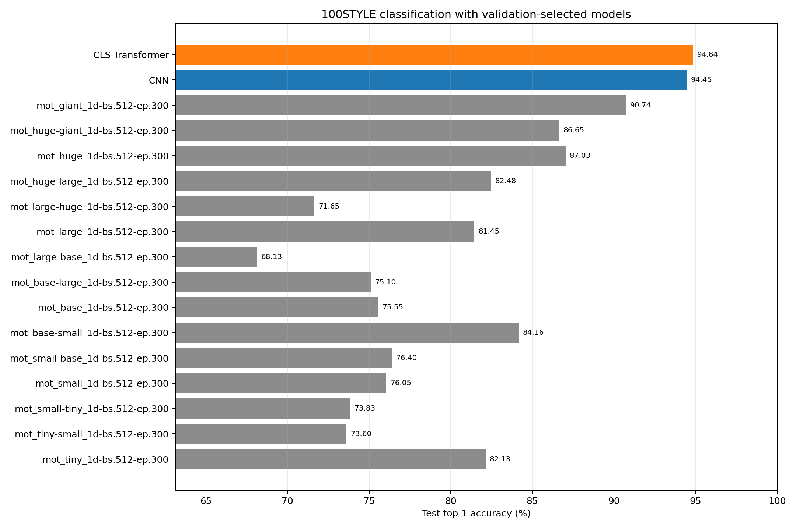

| Method | Selection | Best epoch | Val top-1 | Val macro | Test top-1 | Test macro | Test top-5 |
|---|---:|---:|---:|---:|---:|---:|---:|
| CLS Transformer | best val epoch | 71 | 94.84 | 94.72 | 94.84 | 94.29 | 98.05 |
| CNN | best val epoch | 76 | 94.26 | 94.25 | 94.45 | 93.87 | 97.67 |
| `mot_giant_1d-bs.512-ep.300` | LR 0.3 | 48 | 90.52 | 90.37 | 90.74 | 89.99 | 95.37 |
| `mot_huge-giant_1d-bs.512-ep.300` | LR 0.3 | 43 | 87.46 | 87.15 | 86.65 | 85.82 | 94.41 |
| `mot_huge_1d-bs.512-ep.300` | LR 0.3 | 45 | 88.03 | 87.94 | 87.03 | 85.95 | 95.03 |
| `mot_huge-large_1d-bs.512-ep.300` | LR 0.3 | 43 | 82.41 | 82.21 | 82.48 | 81.31 | 92.54 |
| `mot_large-huge_1d-bs.512-ep.300` | LR 0.1 | 39 | 72.70 | 72.18 | 71.65 | 70.35 | 87.30 |
| `mot_large_1d-bs.512-ep.300` | LR 0.1 | 45 | 82.79 | 82.42 | 81.45 | 80.48 | 92.23 |
| `mot_large-base_1d-bs.512-ep.300` | LR 0.3 | 48 | 68.15 | 67.86 | 68.13 | 66.72 | 85.20 |
| `mot_base-large_1d-bs.512-ep.300` | LR 0.1 | 43 | 76.86 | 76.23 | 75.10 | 73.81 | 89.29 |
| `mot_base_1d-bs.512-ep.300` | LR 0.3 | 36 | 75.91 | 75.06 | 75.55 | 73.99 | 89.33 |
| `mot_base-small_1d-bs.512-ep.300` | LR 0.3 | 46 | 84.24 | 83.71 | 84.16 | 83.20 | 92.65 |
| `mot_small-base_1d-bs.512-ep.300` | LR 0.3 | 49 | 77.59 | 77.67 | 76.40 | 75.13 | 90.02 |
| `mot_small_1d-bs.512-ep.300` | LR 0.7 | 42 | 76.52 | 76.31 | 76.05 | 74.56 | 89.94 |
| `mot_small-tiny_1d-bs.512-ep.300` | LR 0.7 | 48 | 73.88 | 73.63 | 73.83 | 72.36 | 88.52 |
| `mot_tiny-small_1d-bs.512-ep.300` | LR 0.7 | 48 | 73.61 | 73.26 | 73.60 | 72.06 | 88.56 |
| `mot_tiny_1d-bs.512-ep.300` | LR 0.3 | 36 | 82.52 | 82.23 | 82.13 | 81.33 | 93.00 |

## Key findings

- The CLS Transformer is the strongest method at 94.84% test top-1, followed by the CNN at 94.45%.
- The strongest validation-selected linear probe is `mot_giant_1d-bs.512-ep.300` with LR 0.3, reaching 90.74% test top-1.
- The CNN and CLS Transformer exceed that probe by 3.71 and 4.09 percentage points, respectively.
- These results compare temporal classifiers trained end to end with a linear head on globally mean-pooled frozen features; they do not isolate encoder quality from the pooling bottleneck.

## Supervised raw-motion classifiers

Both classifiers use normalized `[90,366]` motion windows, ordinary cross entropy, AdamW with LR `3e-4` and weight decay `0.05`, five warmup epochs, cosine decay over 100 epochs, batch size 256, BF16 autocast, and seed 42.

| Method | Selection | Best epoch | Val top-1 | Val macro | Test top-1 | Test macro | Test top-5 |
|---|---:|---:|---:|---:|---:|---:|---:|
| CLS Transformer | best val epoch | 71 | 94.84 | 94.72 | 94.84 | 94.29 | 98.05 |
| CNN | best val epoch | 76 | 94.26 | 94.25 | 94.45 | 93.87 | 97.67 |

Architecture details:

- CNN: temporal ResNet with widths 256/384/512, two residual blocks per stage, and masked mean pooling.
- CLS Transformer: dimension 256, eight blocks, eight heads, MLP ratio 4, learnable CLS token, and CLS-position embedding.

## Linear-probe sweep

The sweep evaluates 15 latest Motion-JEPA checkpoints at initial learning rates `0.1`, `0.3`, `0.5`, `0.7`, `1`. Each biased linear head is trained for 50 epochs with SGD, momentum 0.9, zero weight decay, cosine decay, batch size 256, and seed 42. Frozen EMA target-encoder outputs are mean-pooled over valid tokens.

### Model comparison at LR 0.3

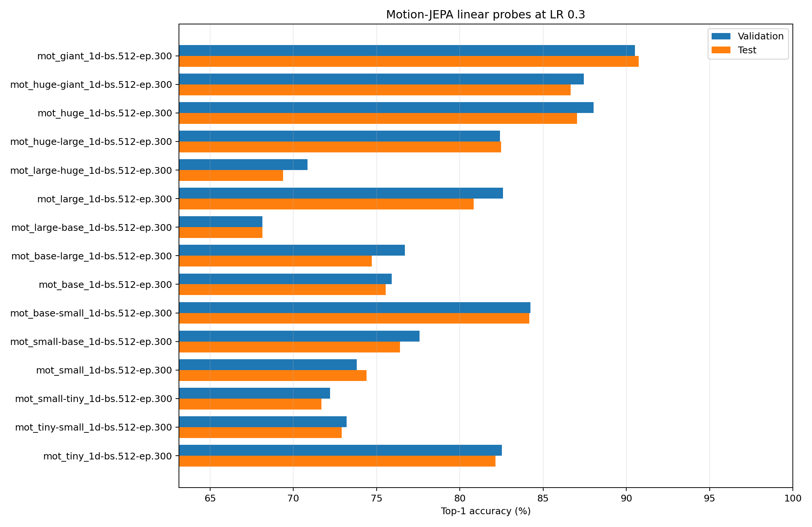

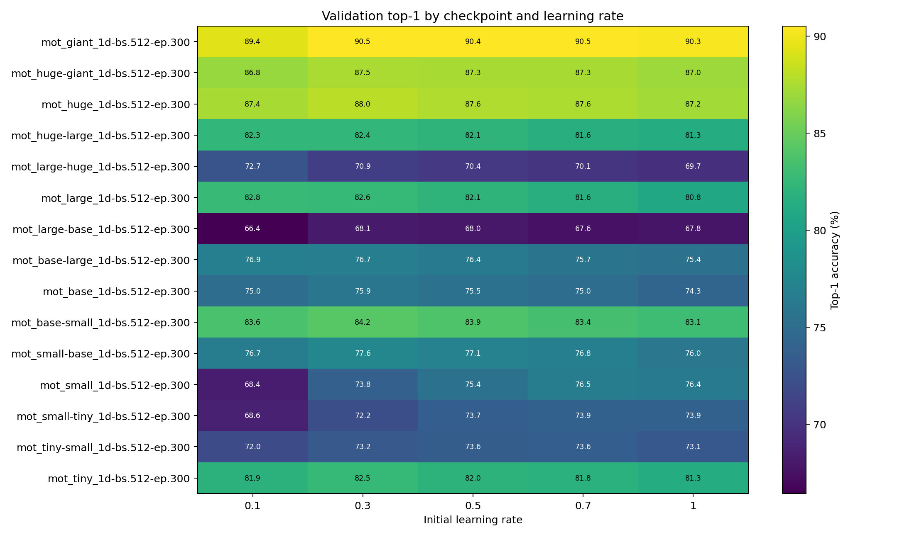

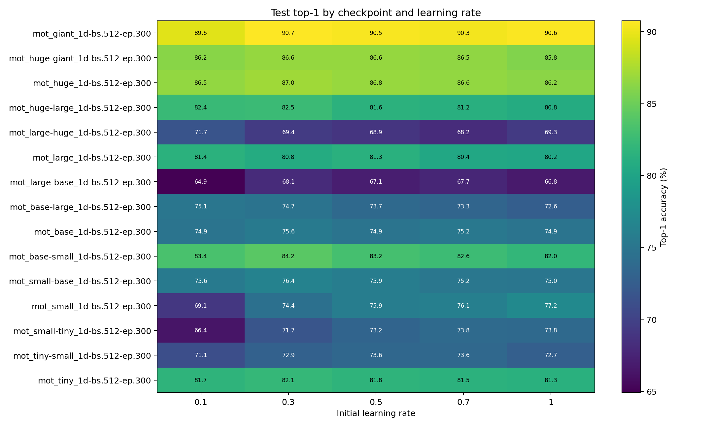

### Checkpoints

| Run | Encoder | Feature dim | SHA256 |
|---|---:|---:|---|
| `mot_giant_1d-bs.512-ep.300` | `mot_giant_1d` | 1024 | `f1109bc53e367c006456fb0d98537459bfc0cfd961e510ceaea691af9f62fae8` |
| `mot_huge-giant_1d-bs.512-ep.300` | `mot_huge_1d` | 768 | `52a0a3d100249d6d6769bde7c890a9238c7f822869aae22e49857c8b265f6cd1` |
| `mot_huge_1d-bs.512-ep.300` | `mot_huge_1d` | 768 | `9a696a42b17d83fd2277b2839ef27a265858f20221bb8e4c0fb47b864e08c8c2` |
| `mot_huge-large_1d-bs.512-ep.300` | `mot_huge_1d` | 768 | `9e5e1c63fc166553691c49fcc25b64ad256a408ae9fea4abbd11233750b2321f` |
| `mot_large-huge_1d-bs.512-ep.300` | `mot_large_1d` | 512 | `483dd0ea55ae11fa7d2a516ed2b2512267349266de7eeb4e5346edbeac7db08a` |
| `mot_large_1d-bs.512-ep.300` | `mot_large_1d` | 512 | `8d136e582607f0558695d21cd96edb171e398edd593d63fd5c44571c64f342a8` |
| `mot_large-base_1d-bs.512-ep.300` | `mot_large_1d` | 512 | `7ab2e9c1e1b8886fc08ce388e2be5950b4a112bd1e01d2071c0d881dcee6e5f7` |
| `mot_base-large_1d-bs.512-ep.300` | `mot_base_1d` | 384 | `30bb77c1974cdb4f5ea5656afcc7cc24485dcb1e9bb2b9f256163f810e705a0a` |
| `mot_base_1d-bs.512-ep.300` | `mot_base_1d` | 384 | `714f25a0c402deea68d42ecefb913378039a522670d7d07ba60a8bbf37ee710d` |
| `mot_base-small_1d-bs.512-ep.300` | `mot_base_1d` | 384 | `8b42dde186c095b881cfc807e803435d2e72082e71838930e0ebe872a9713244` |
| `mot_small-base_1d-bs.512-ep.300` | `mot_small_1d` | 256 | `3114d08474c80df9ec23cb45a024ff80e79c1a63f63d2ffb4ae5fa568b9915c8` |
| `mot_small_1d-bs.512-ep.300` | `mot_small_1d` | 256 | `2fcb85118f8aea5338fdb45a1531bfd3bbe92864d058a857c64d8b4772616927` |
| `mot_small-tiny_1d-bs.512-ep.300` | `mot_small_1d` | 256 | `10c2a0d7cbea0687d1662318e1d3fc37661315e60525d9c146e7e93240a9680a` |
| `mot_tiny-small_1d-bs.512-ep.300` | `mot_tiny_1d` | 192 | `9d74f8f927d06edcebbde3f5c6d21cb59a090a7346a40a4c80fb34bf0ce0ac01` |
| `mot_tiny_1d-bs.512-ep.300` | `mot_tiny_1d` | 192 | `e5f6eb8a55f49db2f54608cca8fcddd655bef642d848d44b159ee24242b32571` |

## Full learning-rate results

### mot_giant_1d-bs.512-ep.300

Validation-selected LR: `0.3`.

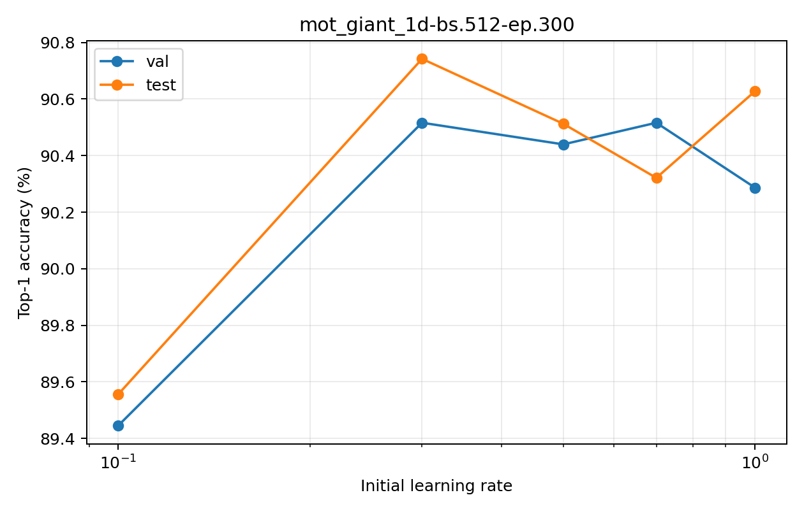

| LR | Val top-1 | Val macro | Val top-5 | Test top-1 | Test macro | Test top-5 |
|---:|---:|---:|---:|---:|---:|---:|
| 0.1 | 89.45 | 89.43 | 94.26 | 89.56 | 88.77 | 94.38 |
| 0.3 | 90.52 | 90.37 | 94.99 | 90.74 | 89.99 | 95.37 |
| 0.5 | 90.44 | 90.31 | 95.22 | 90.51 | 89.80 | 95.68 |
| 0.7 | 90.52 | 90.30 | 95.03 | 90.32 | 89.54 | 95.56 |
| 1 | 90.29 | 90.14 | 95.07 | 90.63 | 89.88 | 95.37 |

### mot_huge-giant_1d-bs.512-ep.300

Validation-selected LR: `0.3`.

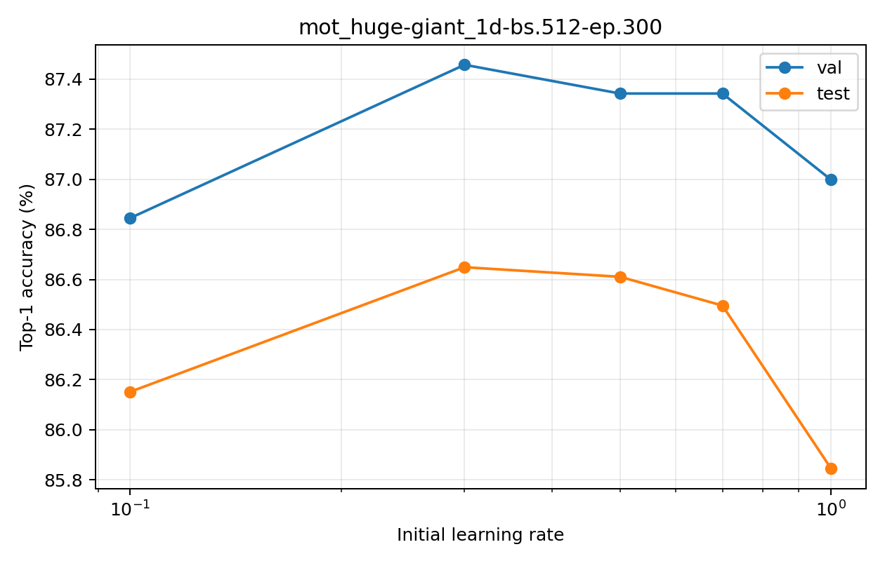

| LR | Val top-1 | Val macro | Val top-5 | Test top-1 | Test macro | Test top-5 |
|---:|---:|---:|---:|---:|---:|---:|
| 0.1 | 86.85 | 86.45 | 94.26 | 86.15 | 85.09 | 93.46 |
| 0.3 | 87.46 | 87.15 | 94.80 | 86.65 | 85.82 | 94.41 |
| 0.5 | 87.34 | 87.02 | 94.76 | 86.61 | 85.86 | 94.30 |
| 0.7 | 87.34 | 87.07 | 94.80 | 86.50 | 85.71 | 94.19 |
| 1 | 87.00 | 86.69 | 94.95 | 85.85 | 85.06 | 94.15 |

### mot_huge_1d-bs.512-ep.300

Validation-selected LR: `0.3`.

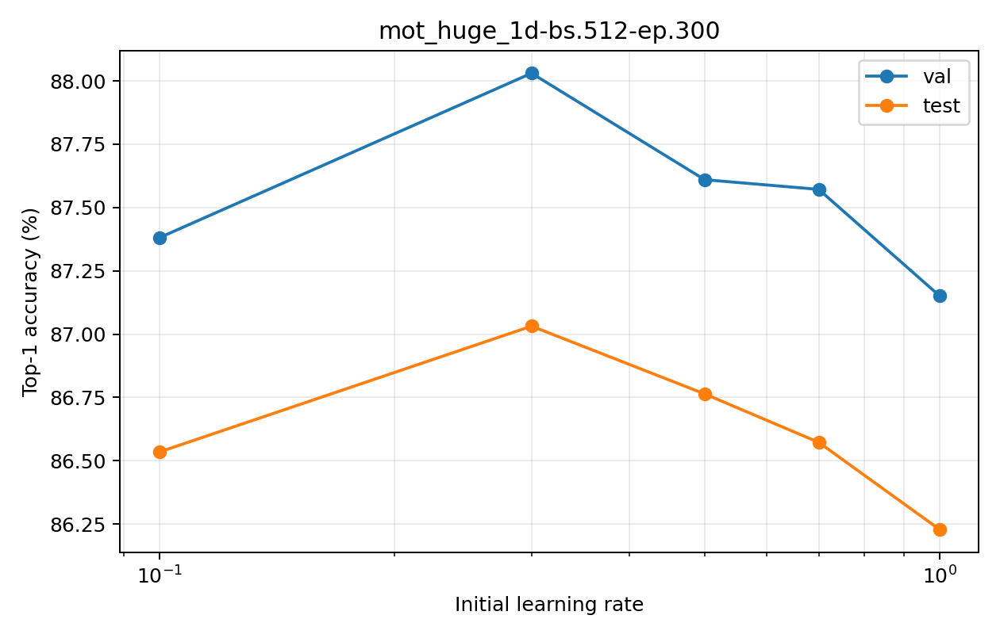

| LR | Val top-1 | Val macro | Val top-5 | Test top-1 | Test macro | Test top-5 |
|---:|---:|---:|---:|---:|---:|---:|
| 0.1 | 87.38 | 87.19 | 94.00 | 86.53 | 85.53 | 94.30 |
| 0.3 | 88.03 | 87.94 | 94.76 | 87.03 | 85.95 | 95.03 |
| 0.5 | 87.61 | 87.58 | 94.88 | 86.76 | 85.67 | 95.18 |
| 0.7 | 87.57 | 87.35 | 94.95 | 86.57 | 85.31 | 94.95 |
| 1 | 87.15 | 86.93 | 94.95 | 86.23 | 85.00 | 94.95 |

### mot_huge-large_1d-bs.512-ep.300

Validation-selected LR: `0.3`.

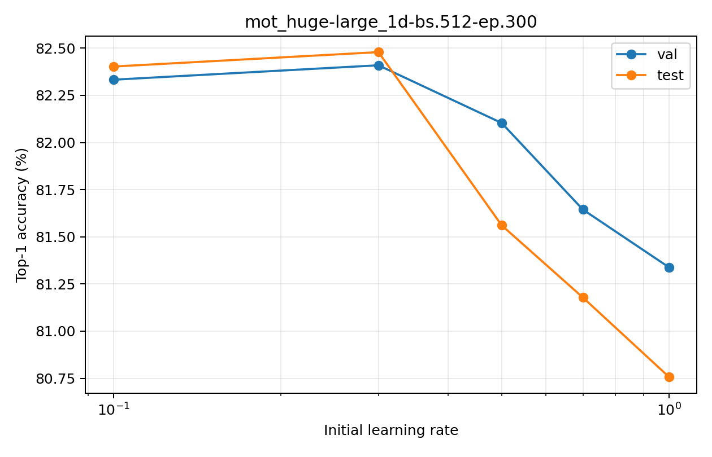

| LR | Val top-1 | Val macro | Val top-5 | Test top-1 | Test macro | Test top-5 |
|---:|---:|---:|---:|---:|---:|---:|
| 0.1 | 82.33 | 82.16 | 92.16 | 82.40 | 81.28 | 92.27 |
| 0.3 | 82.41 | 82.21 | 92.39 | 82.48 | 81.31 | 92.54 |
| 0.5 | 82.10 | 82.00 | 92.28 | 81.56 | 80.44 | 92.58 |
| 0.7 | 81.64 | 81.46 | 92.35 | 81.18 | 80.04 | 92.39 |
| 1 | 81.34 | 81.22 | 92.08 | 80.76 | 79.45 | 92.31 |

### mot_large-huge_1d-bs.512-ep.300

Validation-selected LR: `0.1`.

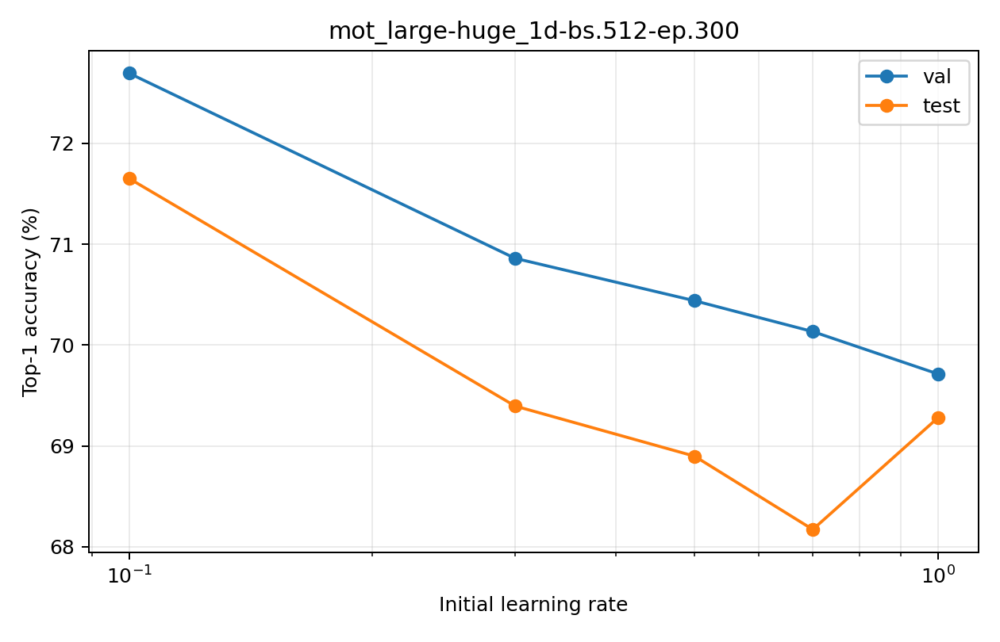

| LR | Val top-1 | Val macro | Val top-5 | Test top-1 | Test macro | Test top-5 |
|---:|---:|---:|---:|---:|---:|---:|
| 0.1 | 72.70 | 72.18 | 87.80 | 71.65 | 70.35 | 87.30 |
| 0.3 | 70.86 | 70.47 | 87.04 | 69.40 | 68.02 | 86.42 |
| 0.5 | 70.44 | 70.10 | 86.77 | 68.90 | 67.43 | 86.50 |
| 0.7 | 70.13 | 69.71 | 86.50 | 68.17 | 66.73 | 86.42 |
| 1 | 69.71 | 69.19 | 86.88 | 69.28 | 67.96 | 85.54 |

### mot_large_1d-bs.512-ep.300

Validation-selected LR: `0.1`.

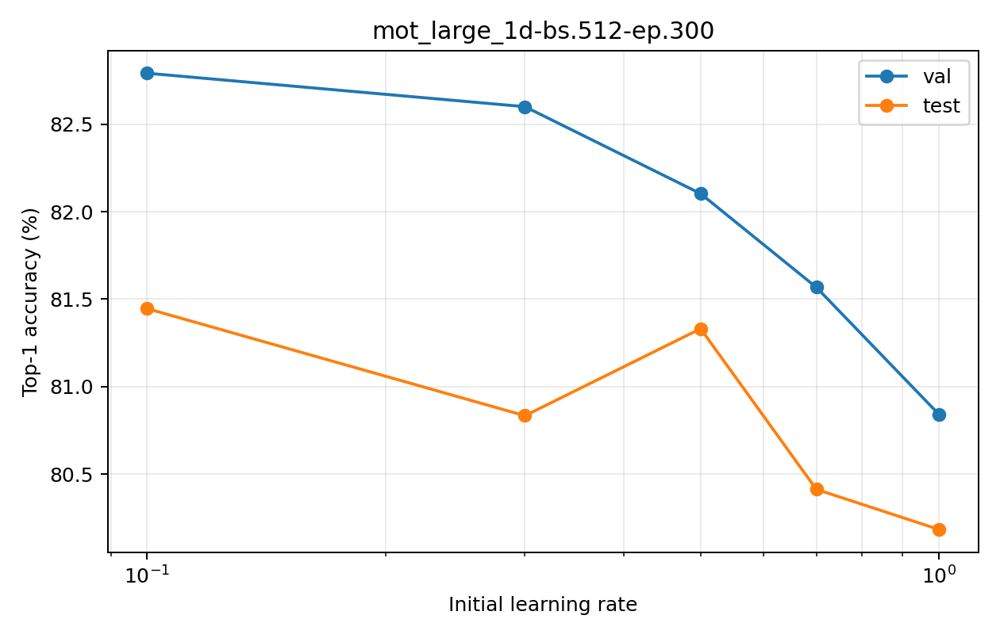

| LR | Val top-1 | Val macro | Val top-5 | Test top-1 | Test macro | Test top-5 |
|---:|---:|---:|---:|---:|---:|---:|
| 0.1 | 82.79 | 82.42 | 93.00 | 81.45 | 80.48 | 92.23 |
| 0.3 | 82.60 | 81.94 | 93.19 | 80.83 | 79.87 | 92.81 |
| 0.5 | 82.10 | 81.60 | 93.31 | 81.33 | 80.41 | 93.04 |
| 0.7 | 81.57 | 80.89 | 92.89 | 80.41 | 79.34 | 92.65 |
| 1 | 80.84 | 80.12 | 92.66 | 80.18 | 79.05 | 92.58 |

### mot_large-base_1d-bs.512-ep.300

Validation-selected LR: `0.3`.

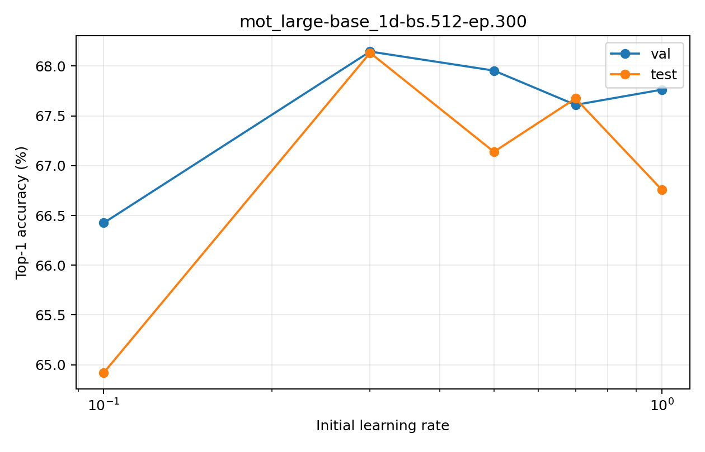

| LR | Val top-1 | Val macro | Val top-5 | Test top-1 | Test macro | Test top-5 |
|---:|---:|---:|---:|---:|---:|---:|
| 0.1 | 66.42 | 66.01 | 84.40 | 64.92 | 63.20 | 84.28 |
| 0.3 | 68.15 | 67.86 | 85.93 | 68.13 | 66.72 | 85.20 |
| 0.5 | 67.95 | 67.95 | 85.47 | 67.14 | 65.69 | 85.31 |
| 0.7 | 67.61 | 67.52 | 85.43 | 67.67 | 66.37 | 84.93 |
| 1 | 67.76 | 67.60 | 85.43 | 66.76 | 65.36 | 85.12 |

### mot_base-large_1d-bs.512-ep.300

Validation-selected LR: `0.1`.

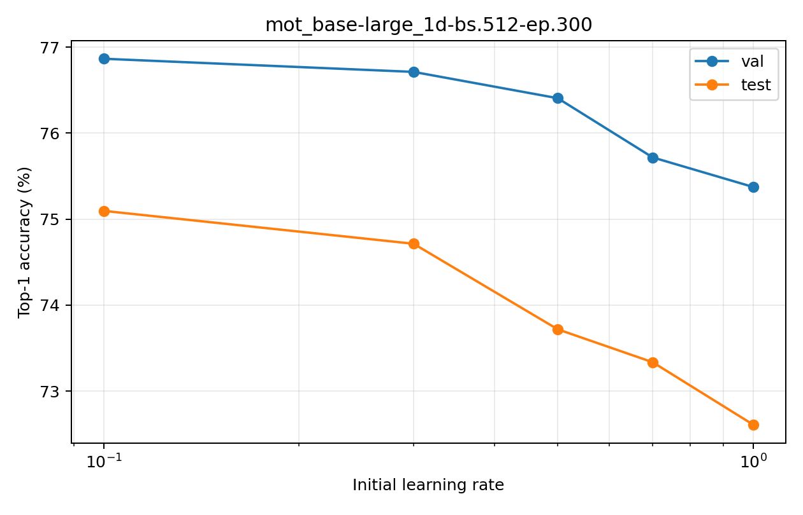

| LR | Val top-1 | Val macro | Val top-5 | Test top-1 | Test macro | Test top-5 |
|---:|---:|---:|---:|---:|---:|---:|
| 0.1 | 76.86 | 76.23 | 89.41 | 75.10 | 73.81 | 89.29 |
| 0.3 | 76.71 | 76.22 | 88.99 | 74.71 | 73.58 | 89.40 |
| 0.5 | 76.41 | 76.11 | 88.83 | 73.72 | 72.37 | 89.67 |
| 0.7 | 75.72 | 75.48 | 88.49 | 73.34 | 72.09 | 89.29 |
| 1 | 75.37 | 75.16 | 88.60 | 72.61 | 71.25 | 89.21 |

### mot_base_1d-bs.512-ep.300

Validation-selected LR: `0.3`.

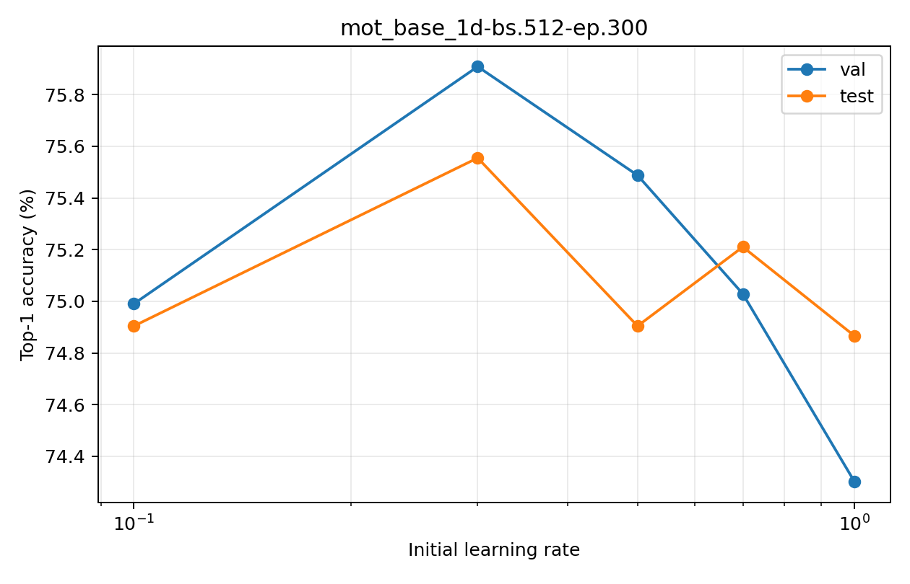

| LR | Val top-1 | Val macro | Val top-5 | Test top-1 | Test macro | Test top-5 |
|---:|---:|---:|---:|---:|---:|---:|
| 0.1 | 74.99 | 74.22 | 89.25 | 74.90 | 73.34 | 89.02 |
| 0.3 | 75.91 | 75.06 | 90.10 | 75.55 | 73.99 | 89.33 |
| 0.5 | 75.49 | 74.70 | 89.98 | 74.90 | 73.48 | 89.44 |
| 0.7 | 75.03 | 74.16 | 90.06 | 75.21 | 73.76 | 89.71 |
| 1 | 74.30 | 73.30 | 89.75 | 74.87 | 73.50 | 89.86 |

### mot_base-small_1d-bs.512-ep.300

Validation-selected LR: `0.3`.

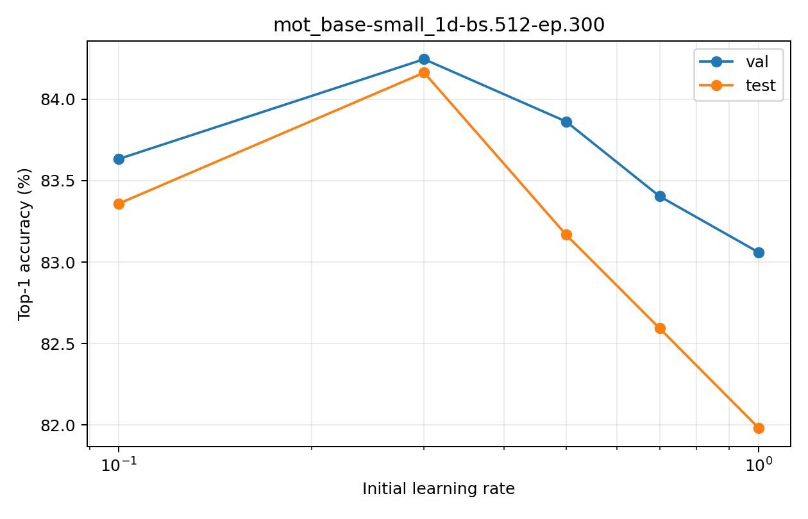

| LR | Val top-1 | Val macro | Val top-5 | Test top-1 | Test macro | Test top-5 |
|---:|---:|---:|---:|---:|---:|---:|
| 0.1 | 83.63 | 83.11 | 92.31 | 83.36 | 82.33 | 92.23 |
| 0.3 | 84.24 | 83.71 | 93.27 | 84.16 | 83.20 | 92.65 |
| 0.5 | 83.86 | 83.15 | 92.89 | 83.17 | 82.27 | 92.92 |
| 0.7 | 83.40 | 82.68 | 93.04 | 82.59 | 81.65 | 92.85 |
| 1 | 83.06 | 82.35 | 92.66 | 81.98 | 80.94 | 92.43 |

### mot_small-base_1d-bs.512-ep.300

Validation-selected LR: `0.3`.

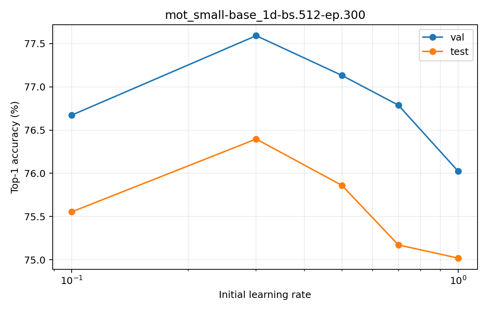

| LR | Val top-1 | Val macro | Val top-5 | Test top-1 | Test macro | Test top-5 |
|---:|---:|---:|---:|---:|---:|---:|
| 0.1 | 76.67 | 76.51 | 89.56 | 75.55 | 74.15 | 89.17 |
| 0.3 | 77.59 | 77.67 | 90.67 | 76.40 | 75.13 | 90.02 |
| 0.5 | 77.13 | 76.90 | 90.78 | 75.86 | 74.52 | 89.94 |
| 0.7 | 76.79 | 76.65 | 90.67 | 75.17 | 74.02 | 89.75 |
| 1 | 76.02 | 75.64 | 90.25 | 75.02 | 73.91 | 89.59 |

### mot_small_1d-bs.512-ep.300

Validation-selected LR: `0.7`.

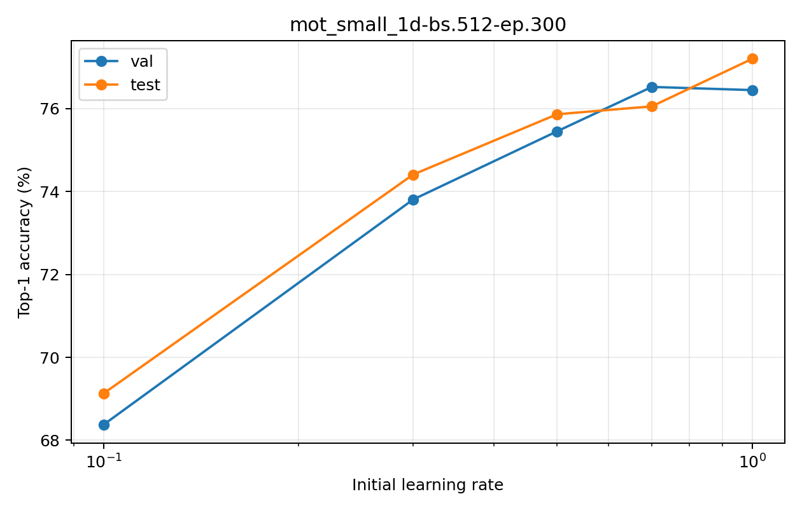

| LR | Val top-1 | Val macro | Val top-5 | Test top-1 | Test macro | Test top-5 |
|---:|---:|---:|---:|---:|---:|---:|
| 0.1 | 68.37 | 67.98 | 85.97 | 69.13 | 67.27 | 85.92 |
| 0.3 | 73.80 | 73.54 | 88.57 | 74.41 | 72.72 | 88.87 |
| 0.5 | 75.45 | 75.09 | 89.52 | 75.86 | 74.25 | 89.82 |
| 0.7 | 76.52 | 76.31 | 89.71 | 76.05 | 74.56 | 89.94 |
| 1 | 76.44 | 76.10 | 90.36 | 77.20 | 75.81 | 90.44 |

### mot_small-tiny_1d-bs.512-ep.300

Validation-selected LR: `0.7`.

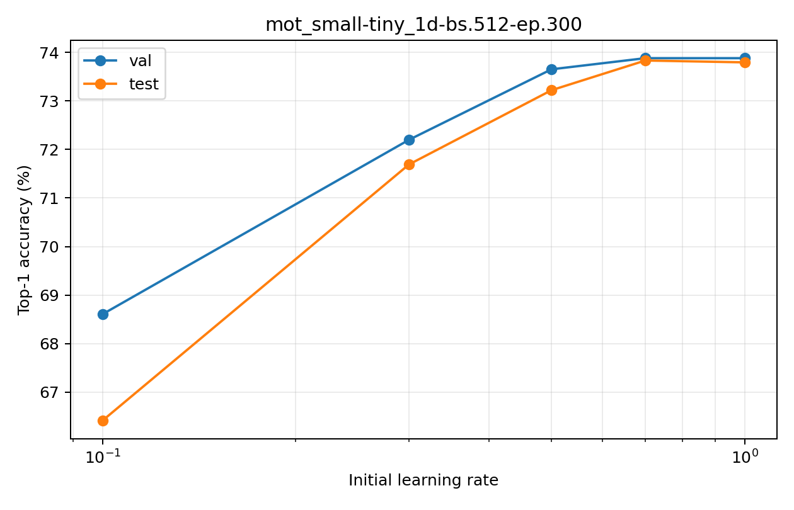

| LR | Val top-1 | Val macro | Val top-5 | Test top-1 | Test macro | Test top-5 |
|---:|---:|---:|---:|---:|---:|---:|
| 0.1 | 68.60 | 68.29 | 84.74 | 66.41 | 64.95 | 84.81 |
| 0.3 | 72.20 | 71.70 | 87.04 | 71.69 | 70.29 | 87.53 |
| 0.5 | 73.65 | 73.25 | 88.03 | 73.22 | 71.74 | 88.37 |
| 0.7 | 73.88 | 73.63 | 88.41 | 73.83 | 72.36 | 88.52 |
| 1 | 73.88 | 73.54 | 88.30 | 73.79 | 72.36 | 89.21 |

### mot_tiny-small_1d-bs.512-ep.300

Validation-selected LR: `0.7`.

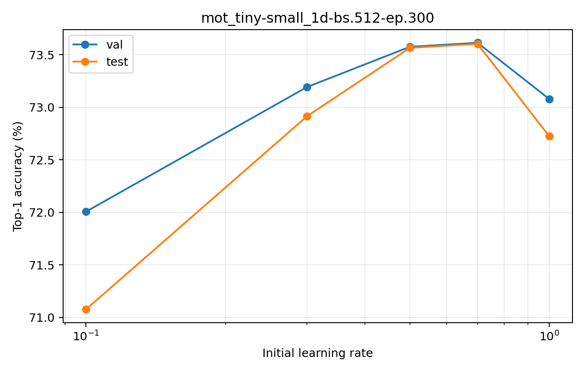

| LR | Val top-1 | Val macro | Val top-5 | Test top-1 | Test macro | Test top-5 |
|---:|---:|---:|---:|---:|---:|---:|
| 0.1 | 72.01 | 71.62 | 86.62 | 71.08 | 69.46 | 86.84 |
| 0.3 | 73.19 | 72.86 | 88.49 | 72.92 | 71.22 | 88.64 |
| 0.5 | 73.58 | 73.20 | 88.91 | 73.57 | 71.97 | 88.60 |
| 0.7 | 73.61 | 73.26 | 88.87 | 73.60 | 72.06 | 88.56 |
| 1 | 73.08 | 72.78 | 89.02 | 72.72 | 71.30 | 88.60 |

### mot_tiny_1d-bs.512-ep.300

Validation-selected LR: `0.3`.

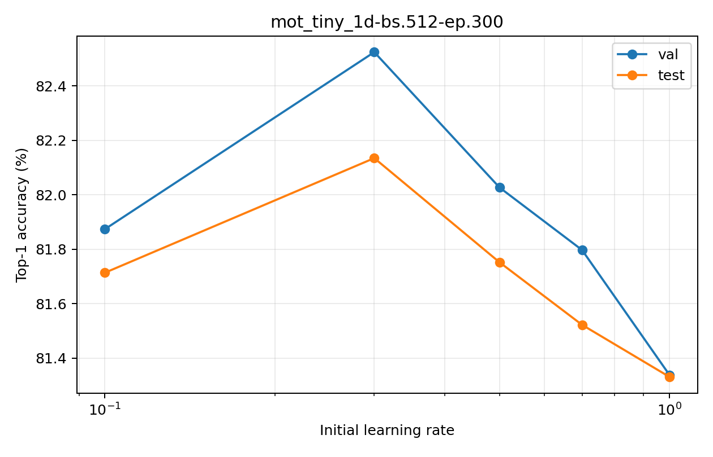

| LR | Val top-1 | Val macro | Val top-5 | Test top-1 | Test macro | Test top-5 |
|---:|---:|---:|---:|---:|---:|---:|
| 0.1 | 81.87 | 81.47 | 91.74 | 81.71 | 80.79 | 92.43 |
| 0.3 | 82.52 | 82.23 | 92.43 | 82.13 | 81.33 | 93.00 |
| 0.5 | 82.03 | 81.73 | 92.43 | 81.75 | 80.86 | 93.23 |
| 0.7 | 81.80 | 81.45 | 92.50 | 81.52 | 80.67 | 93.15 |
| 1 | 81.34 | 80.91 | 92.05 | 81.33 | 80.40 | 93.15 |

## Artifacts

- [Validation-selected results](selected-results.csv)
- [Probe per-run results](linear-probe/sweep-results.csv)
- [Probe per-LR aggregates](linear-probe/aggregate-results.csv)
- [Probe per-epoch metrics](linear-probe/epoch-metrics.csv)
- [Probe configuration](linear-probe/sweep-config.json)
- [CNN metrics](classifiers/cnn-metrics.csv)
- [Transformer metrics](classifiers/transformer-metrics.csv)
- [Classifier summaries](classifiers/results.json)
