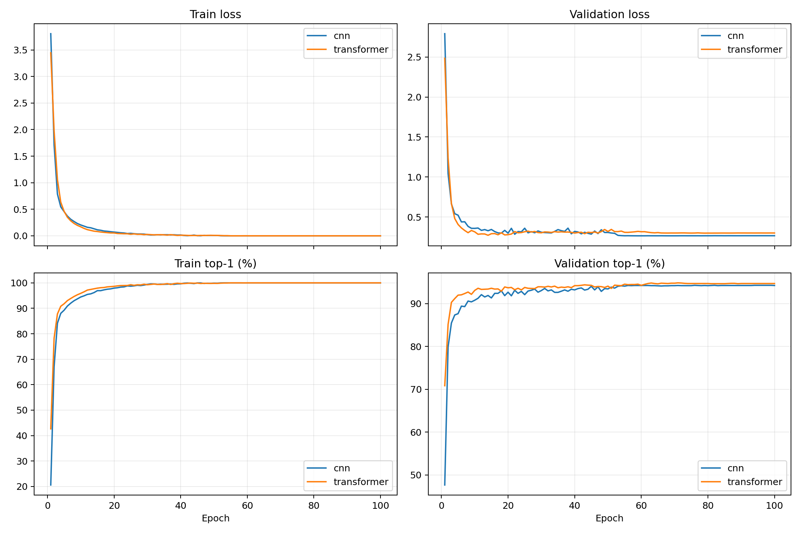

# 100STYLE Raw-Motion Classifiers

Both models were trained from 100STYLE raw motion `[90,366]` with seed 42.

## Shared settings

- 100STYLE train statistics normalization
- CrossEntropyLoss; no class weighting, balanced sampling, or augmentation
- AdamW, LR 3e-4, weight decay 0.05
- 5-epoch warmup followed by cosine decay, 100 epochs
- CUDA BF16 autocast; float32 parameters and optimizer
- Best validation top-1 checkpoint restored before one test evaluation

## Results

| Model | Parameters | Best epoch | Val top-1 | Val macro | Val top-5 | Test top-1 | Test macro | Test top-5 |
|---|---:|---:|---:|---:|---:|---:|---:|---:|
| cnn | 6,371,172 | 76 | 94.26 | 94.25 | 97.74 | 94.45 | 93.87 | 97.67 |
| transformer | 6,461,796 | 71 | 94.84 | 94.72 | 97.67 | 94.84 | 94.29 | 98.05 |

## Model architecture

- CNN: temporal ResNet, widths 256/384/512, two blocks per stage, masked mean pooling.
- Transformer: dim 256, 8 blocks, 8 heads, MLP ratio 4, learnable CLS-token pooling.

## Raw metrics

- [CNN metrics](cnn-metrics.csv)
- [Transformer metrics](transformer-metrics.csv)
- [Classifier summaries](results.json)
