# All-Latest Motion-JEPA Linear-Probe LR Sweep

## Settings

- Checkpoints: 15 latest checkpoints from direct children of `output/`
- Dataset: `/source/seokhyeon/motion-jepa/motion-jepa/dataset/100style-soma77-processed`
- Learning rates: `0.001`, `0.003`, `0.01`, `0.03`, `0.1`, `0.3`, `1`
- Seeds: 0, 1, 2
- Epochs: 50
- Optimizer: SGD, momentum 0.9, weight decay 0.0
- Schedule: cosine decay; loss: ordinary cross entropy
- Pooling: frozen EMA target encoder valid-token global mean
- Test results are reported for every LR; the sweep does not select a single best LR.

## Overall comparison

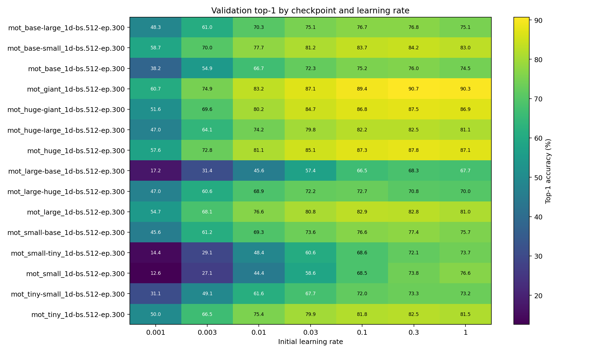

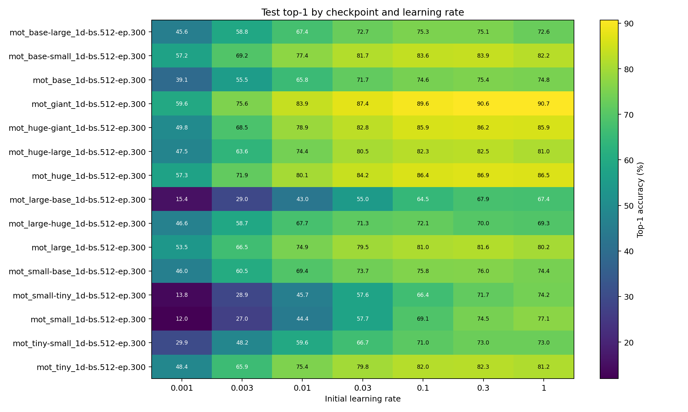

Values are means over seeds 0-2 and are reported in percent.

## Checkpoints

| Run | Encoder | Feature dim | SHA256 |
|---|---:|---:|---|
| `mot_base-large_1d-bs.512-ep.300` | `mot_base_1d` | 384 | `30bb77c1974cdb4f5ea5656afcc7cc24485dcb1e9bb2b9f256163f810e705a0a` |
| `mot_base-small_1d-bs.512-ep.300` | `mot_base_1d` | 384 | `8b42dde186c095b881cfc807e803435d2e72082e71838930e0ebe872a9713244` |
| `mot_base_1d-bs.512-ep.300` | `mot_base_1d` | 384 | `714f25a0c402deea68d42ecefb913378039a522670d7d07ba60a8bbf37ee710d` |
| `mot_giant_1d-bs.512-ep.300` | `mot_giant_1d` | 1024 | `f1109bc53e367c006456fb0d98537459bfc0cfd961e510ceaea691af9f62fae8` |
| `mot_huge-giant_1d-bs.512-ep.300` | `mot_huge_1d` | 768 | `52a0a3d100249d6d6769bde7c890a9238c7f822869aae22e49857c8b265f6cd1` |
| `mot_huge-large_1d-bs.512-ep.300` | `mot_huge_1d` | 768 | `9e5e1c63fc166553691c49fcc25b64ad256a408ae9fea4abbd11233750b2321f` |
| `mot_huge_1d-bs.512-ep.300` | `mot_huge_1d` | 768 | `9a696a42b17d83fd2277b2839ef27a265858f20221bb8e4c0fb47b864e08c8c2` |
| `mot_large-base_1d-bs.512-ep.300` | `mot_large_1d` | 512 | `7ab2e9c1e1b8886fc08ce388e2be5950b4a112bd1e01d2071c0d881dcee6e5f7` |
| `mot_large-huge_1d-bs.512-ep.300` | `mot_large_1d` | 512 | `483dd0ea55ae11fa7d2a516ed2b2512267349266de7eeb4e5346edbeac7db08a` |
| `mot_large_1d-bs.512-ep.300` | `mot_large_1d` | 512 | `8d136e582607f0558695d21cd96edb171e398edd593d63fd5c44571c64f342a8` |
| `mot_small-base_1d-bs.512-ep.300` | `mot_small_1d` | 256 | `3114d08474c80df9ec23cb45a024ff80e79c1a63f63d2ffb4ae5fa568b9915c8` |
| `mot_small-tiny_1d-bs.512-ep.300` | `mot_small_1d` | 256 | `10c2a0d7cbea0687d1662318e1d3fc37661315e60525d9c146e7e93240a9680a` |
| `mot_small_1d-bs.512-ep.300` | `mot_small_1d` | 256 | `2fcb85118f8aea5338fdb45a1531bfd3bbe92864d058a857c64d8b4772616927` |
| `mot_tiny-small_1d-bs.512-ep.300` | `mot_tiny_1d` | 192 | `9d74f8f927d06edcebbde3f5c6d21cb59a090a7346a40a4c80fb34bf0ce0ac01` |
| `mot_tiny_1d-bs.512-ep.300` | `mot_tiny_1d` | 192 | `e5f6eb8a55f49db2f54608cca8fcddd655bef642d848d44b159ee24242b32571` |

## Results by learning rate

### mot_base-large_1d-bs.512-ep.300

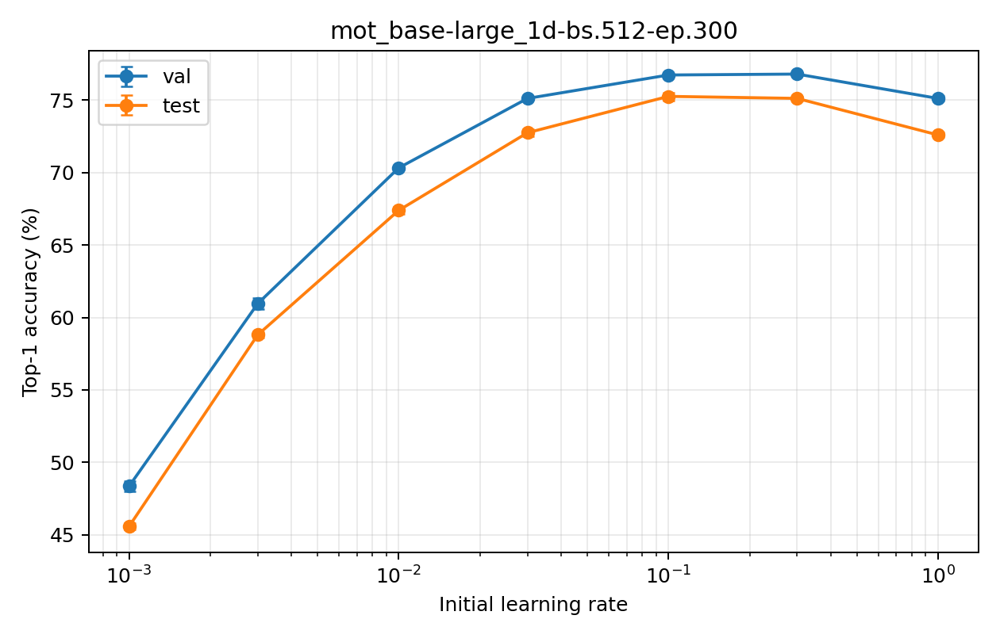

| LR | Val top-1 | Val macro | Val top-5 | Test top-1 | Test macro | Test top-5 |
|---:|---:|---:|---:|---:|---:|---:|
| 0.001 | 48.35 +/- 0.35 | 46.23 +/- 0.20 | 72.59 +/- 0.29 | 45.58 +/- 0.21 | 42.91 +/- 0.29 | 70.43 +/- 0.30 |
| 0.003 | 60.96 +/- 0.38 | 59.25 +/- 0.38 | 80.89 +/- 0.02 | 58.80 +/- 0.18 | 56.84 +/- 0.14 | 79.80 +/- 0.29 |
| 0.01 | 70.33 +/- 0.10 | 68.98 +/- 0.11 | 86.51 +/- 0.22 | 67.39 +/- 0.25 | 65.88 +/- 0.30 | 85.22 +/- 0.08 |
| 0.03 | 75.12 +/- 0.12 | 74.31 +/- 0.17 | 88.58 +/- 0.08 | 72.75 +/- 0.26 | 71.38 +/- 0.20 | 87.87 +/- 0.18 |
| 0.1 | 76.74 +/- 0.04 | 76.13 +/- 0.08 | 89.55 +/- 0.19 | 75.26 +/- 0.27 | 73.96 +/- 0.22 | 89.39 +/- 0.10 |
| 0.3 | 76.80 +/- 0.06 | 76.38 +/- 0.05 | 89.32 +/- 0.06 | 75.12 +/- 0.13 | 73.79 +/- 0.19 | 89.57 +/- 0.10 |
| 1 | 75.12 +/- 0.17 | 74.73 +/- 0.17 | 88.45 +/- 0.18 | 72.60 +/- 0.17 | 71.26 +/- 0.17 | 89.01 +/- 0.15 |

Across the evaluated range, validation top-1 spans 28.45 percentage points and test top-1 spans 29.69 percentage points.

### mot_base-small_1d-bs.512-ep.300

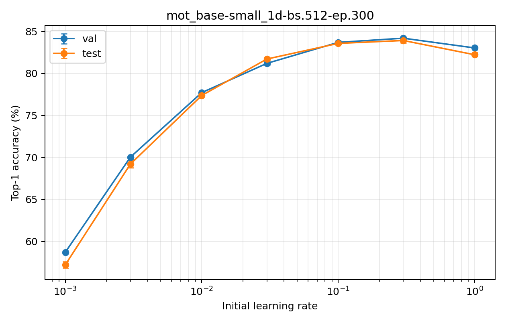

| LR | Val top-1 | Val macro | Val top-5 | Test top-1 | Test macro | Test top-5 |
|---:|---:|---:|---:|---:|---:|---:|
| 0.001 | 58.71 +/- 0.17 | 56.89 +/- 0.14 | 78.57 +/- 0.14 | 57.22 +/- 0.39 | 54.93 +/- 0.49 | 78.00 +/- 0.21 |
| 0.003 | 70.03 +/- 0.23 | 69.03 +/- 0.35 | 85.24 +/- 0.10 | 69.20 +/- 0.42 | 67.42 +/- 0.37 | 85.11 +/- 0.12 |
| 0.01 | 77.71 +/- 0.18 | 77.01 +/- 0.25 | 88.81 +/- 0.13 | 77.37 +/- 0.13 | 76.05 +/- 0.18 | 89.43 +/- 0.17 |
| 0.03 | 81.19 +/- 0.21 | 80.84 +/- 0.15 | 90.77 +/- 0.08 | 81.70 +/- 0.13 | 80.61 +/- 0.17 | 91.15 +/- 0.06 |
| 0.1 | 83.68 +/- 0.19 | 83.16 +/- 0.18 | 92.19 +/- 0.10 | 83.56 +/- 0.08 | 82.57 +/- 0.16 | 92.22 +/- 0.06 |
| 0.3 | 84.18 +/- 0.13 | 83.65 +/- 0.09 | 93.24 +/- 0.10 | 83.91 +/- 0.29 | 82.94 +/- 0.31 | 92.88 +/- 0.07 |
| 1 | 83.02 +/- 0.21 | 82.38 +/- 0.21 | 92.87 +/- 0.14 | 82.21 +/- 0.24 | 81.09 +/- 0.22 | 92.64 +/- 0.17 |

Across the evaluated range, validation top-1 spans 25.47 percentage points and test top-1 spans 26.69 percentage points.

### mot_base_1d-bs.512-ep.300

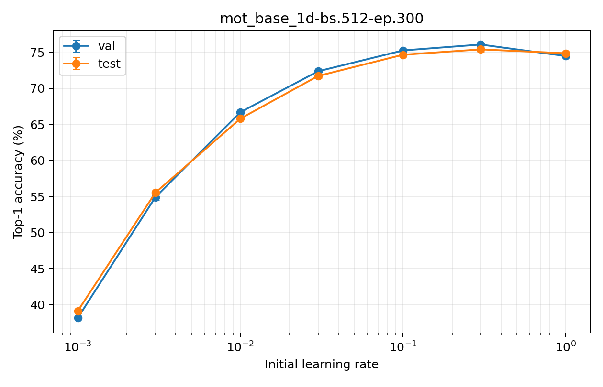

| LR | Val top-1 | Val macro | Val top-5 | Test top-1 | Test macro | Test top-5 |
|---:|---:|---:|---:|---:|---:|---:|
| 0.001 | 38.18 +/- 0.19 | 36.72 +/- 0.12 | 66.83 +/- 0.86 | 39.14 +/- 0.28 | 36.58 +/- 0.30 | 66.07 +/- 0.40 |
| 0.003 | 54.90 +/- 0.42 | 54.04 +/- 0.55 | 78.70 +/- 0.19 | 55.52 +/- 0.22 | 53.44 +/- 0.21 | 77.08 +/- 0.19 |
| 0.01 | 66.68 +/- 0.24 | 66.07 +/- 0.33 | 84.36 +/- 0.30 | 65.79 +/- 0.13 | 63.95 +/- 0.15 | 83.59 +/- 0.07 |
| 0.03 | 72.34 +/- 0.10 | 71.75 +/- 0.08 | 87.51 +/- 0.20 | 71.69 +/- 0.24 | 70.05 +/- 0.25 | 87.26 +/- 0.17 |
| 0.1 | 75.23 +/- 0.16 | 74.48 +/- 0.11 | 89.33 +/- 0.04 | 74.64 +/- 0.13 | 73.02 +/- 0.21 | 88.85 +/- 0.04 |
| 0.3 | 76.05 +/- 0.06 | 75.19 +/- 0.16 | 89.97 +/- 0.18 | 75.38 +/- 0.31 | 73.89 +/- 0.33 | 89.44 +/- 0.21 |
| 1 | 74.46 +/- 0.15 | 73.59 +/- 0.22 | 89.92 +/- 0.06 | 74.84 +/- 0.15 | 73.41 +/- 0.20 | 89.68 +/- 0.13 |

Across the evaluated range, validation top-1 spans 37.87 percentage points and test top-1 spans 36.24 percentage points.

### mot_giant_1d-bs.512-ep.300

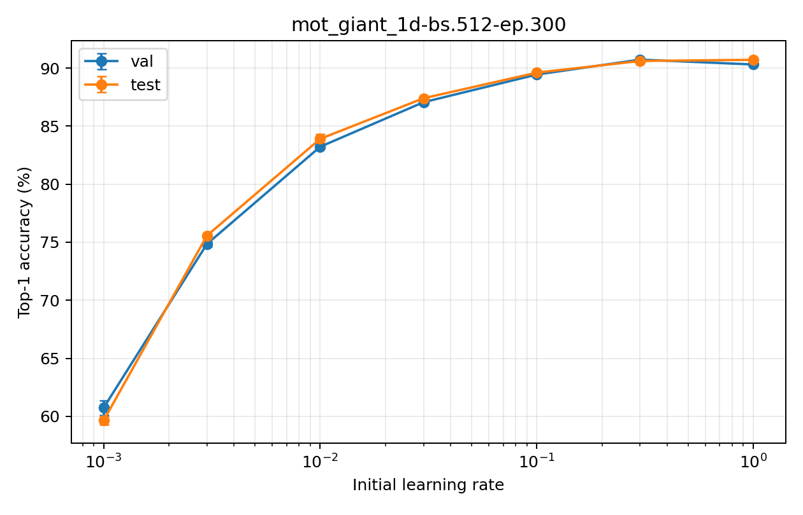

| LR | Val top-1 | Val macro | Val top-5 | Test top-1 | Test macro | Test top-5 |
|---:|---:|---:|---:|---:|---:|---:|
| 0.001 | 60.74 +/- 0.61 | 58.81 +/- 0.68 | 80.43 +/- 0.39 | 59.64 +/- 0.36 | 57.07 +/- 0.49 | 80.18 +/- 0.07 |
| 0.003 | 74.85 +/- 0.22 | 74.26 +/- 0.20 | 88.09 +/- 0.25 | 75.57 +/- 0.14 | 74.52 +/- 0.13 | 87.59 +/- 0.19 |
| 0.01 | 83.22 +/- 0.13 | 82.89 +/- 0.14 | 91.45 +/- 0.16 | 83.91 +/- 0.38 | 83.09 +/- 0.40 | 91.09 +/- 0.11 |
| 0.03 | 87.06 +/- 0.09 | 87.11 +/- 0.05 | 93.19 +/- 0.04 | 87.40 +/- 0.20 | 86.66 +/- 0.17 | 92.68 +/- 0.06 |
| 0.1 | 89.45 +/- 0.07 | 89.39 +/- 0.10 | 94.33 +/- 0.08 | 89.61 +/- 0.13 | 88.86 +/- 0.12 | 94.40 +/- 0.04 |
| 0.3 | 90.73 +/- 0.06 | 90.61 +/- 0.04 | 94.94 +/- 0.04 | 90.61 +/- 0.19 | 89.89 +/- 0.23 | 95.46 +/- 0.06 |
| 1 | 90.31 +/- 0.06 | 90.11 +/- 0.10 | 94.99 +/- 0.04 | 90.72 +/- 0.06 | 89.97 +/- 0.07 | 95.56 +/- 0.08 |

Across the evaluated range, validation top-1 spans 29.99 percentage points and test top-1 spans 31.08 percentage points.

### mot_huge-giant_1d-bs.512-ep.300

| LR | Val top-1 | Val macro | Val top-5 | Test top-1 | Test macro | Test top-5 |
|---:|---:|---:|---:|---:|---:|---:|
| 0.001 | 51.56 +/- 0.53 | 48.73 +/- 0.59 | 75.72 +/- 0.31 | 49.80 +/- 0.12 | 46.55 +/- 0.06 | 75.47 +/- 0.38 |
| 0.003 | 69.60 +/- 0.47 | 68.25 +/- 0.53 | 85.89 +/- 0.21 | 68.52 +/- 0.17 | 66.40 +/- 0.12 | 85.96 +/- 0.20 |
| 0.01 | 80.23 +/- 0.10 | 79.60 +/- 0.11 | 90.34 +/- 0.06 | 78.90 +/- 0.12 | 77.44 +/- 0.16 | 89.72 +/- 0.12 |
| 0.03 | 84.68 +/- 0.09 | 84.15 +/- 0.09 | 92.49 +/- 0.06 | 82.82 +/- 0.14 | 81.53 +/- 0.17 | 92.31 +/- 0.08 |
| 0.1 | 86.77 +/- 0.04 | 86.36 +/- 0.09 | 94.00 +/- 0.04 | 85.86 +/- 0.06 | 84.80 +/- 0.04 | 93.59 +/- 0.08 |
| 0.3 | 87.50 +/- 0.17 | 87.22 +/- 0.21 | 94.66 +/- 0.12 | 86.19 +/- 0.23 | 85.26 +/- 0.29 | 94.44 +/- 0.08 |
| 1 | 86.87 +/- 0.25 | 86.64 +/- 0.30 | 94.79 +/- 0.08 | 85.87 +/- 0.15 | 85.09 +/- 0.16 | 94.20 +/- 0.06 |

Across the evaluated range, validation top-1 spans 35.93 percentage points and test top-1 spans 36.39 percentage points.

### mot_huge-large_1d-bs.512-ep.300

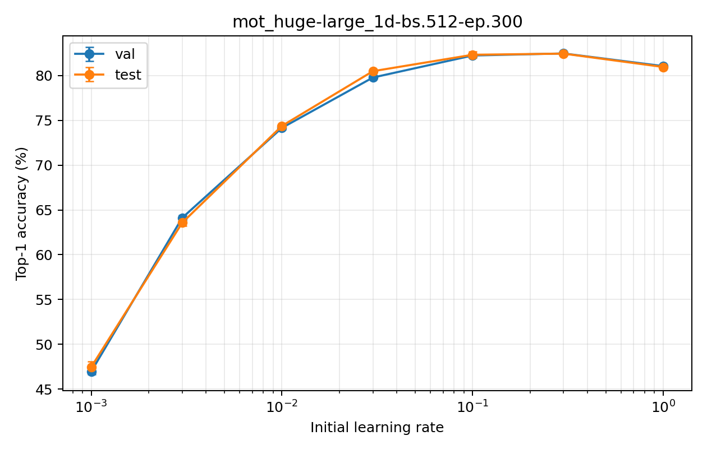

| LR | Val top-1 | Val macro | Val top-5 | Test top-1 | Test macro | Test top-5 |
|---:|---:|---:|---:|---:|---:|---:|
| 0.001 | 46.96 +/- 0.33 | 45.04 +/- 0.32 | 72.62 +/- 0.70 | 47.46 +/- 0.61 | 44.31 +/- 0.55 | 73.06 +/- 0.16 |
| 0.003 | 64.12 +/- 0.28 | 62.93 +/- 0.38 | 82.75 +/- 0.31 | 63.57 +/- 0.33 | 61.06 +/- 0.28 | 83.17 +/- 0.43 |
| 0.01 | 74.16 +/- 0.15 | 73.47 +/- 0.11 | 88.95 +/- 0.18 | 74.38 +/- 0.13 | 72.85 +/- 0.16 | 88.59 +/- 0.12 |
| 0.03 | 79.78 +/- 0.04 | 79.36 +/- 0.08 | 91.28 +/- 0.00 | 80.49 +/- 0.14 | 79.25 +/- 0.16 | 90.96 +/- 0.02 |
| 0.1 | 82.24 +/- 0.11 | 82.11 +/- 0.17 | 92.25 +/- 0.15 | 82.33 +/- 0.33 | 81.14 +/- 0.41 | 92.29 +/- 0.06 |
| 0.3 | 82.47 +/- 0.02 | 82.29 +/- 0.03 | 92.35 +/- 0.07 | 82.45 +/- 0.12 | 81.26 +/- 0.22 | 92.27 +/- 0.07 |
| 1 | 81.06 +/- 0.14 | 81.04 +/- 0.20 | 92.21 +/- 0.08 | 80.96 +/- 0.08 | 79.76 +/- 0.10 | 92.48 +/- 0.12 |

Across the evaluated range, validation top-1 spans 35.51 percentage points and test top-1 spans 34.99 percentage points.

### mot_huge_1d-bs.512-ep.300

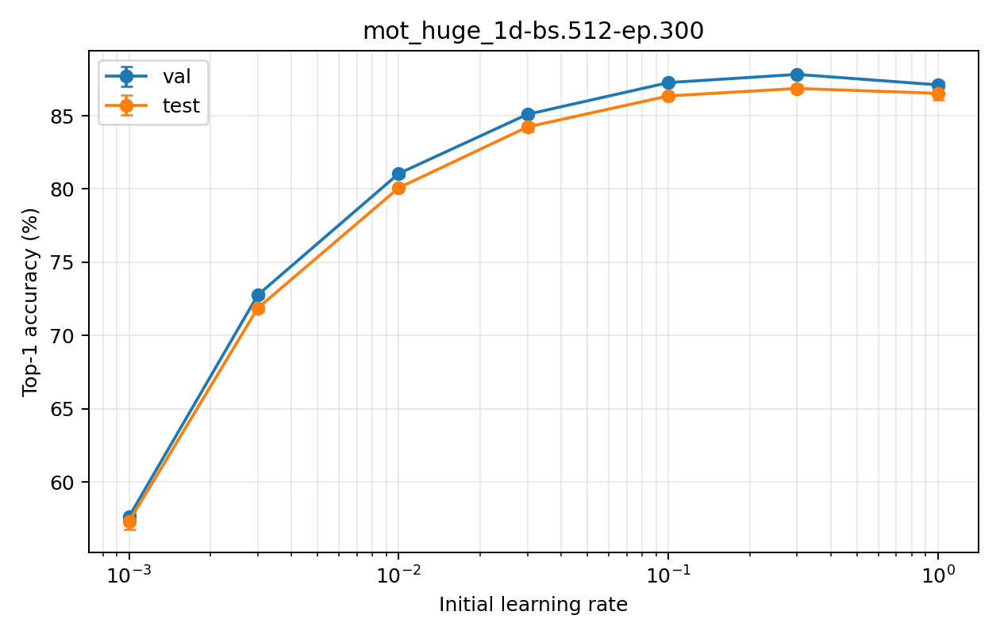

| LR | Val top-1 | Val macro | Val top-5 | Test top-1 | Test macro | Test top-5 |
|---:|---:|---:|---:|---:|---:|---:|
| 0.001 | 57.63 +/- 0.23 | 55.81 +/- 0.28 | 80.10 +/- 0.34 | 57.31 +/- 0.55 | 54.67 +/- 0.54 | 80.04 +/- 0.35 |
| 0.003 | 72.76 +/- 0.18 | 71.91 +/- 0.16 | 87.81 +/- 0.13 | 71.87 +/- 0.21 | 70.07 +/- 0.16 | 86.99 +/- 0.00 |
| 0.01 | 81.06 +/- 0.21 | 80.43 +/- 0.27 | 91.22 +/- 0.11 | 80.08 +/- 0.11 | 78.73 +/- 0.12 | 90.72 +/- 0.06 |
| 0.03 | 85.10 +/- 0.06 | 84.60 +/- 0.04 | 92.93 +/- 0.04 | 84.24 +/- 0.30 | 83.04 +/- 0.26 | 92.43 +/- 0.08 |
| 0.1 | 87.27 +/- 0.07 | 87.01 +/- 0.03 | 93.87 +/- 0.04 | 86.36 +/- 0.06 | 85.34 +/- 0.07 | 94.22 +/- 0.08 |
| 0.3 | 87.83 +/- 0.08 | 87.71 +/- 0.08 | 94.66 +/- 0.08 | 86.87 +/- 0.23 | 85.80 +/- 0.25 | 94.92 +/- 0.09 |
| 1 | 87.11 +/- 0.20 | 86.95 +/- 0.22 | 94.93 +/- 0.10 | 86.53 +/- 0.44 | 85.28 +/- 0.47 | 95.00 +/- 0.06 |

Across the evaluated range, validation top-1 spans 30.20 percentage points and test top-1 spans 29.56 percentage points.

### mot_large-base_1d-bs.512-ep.300

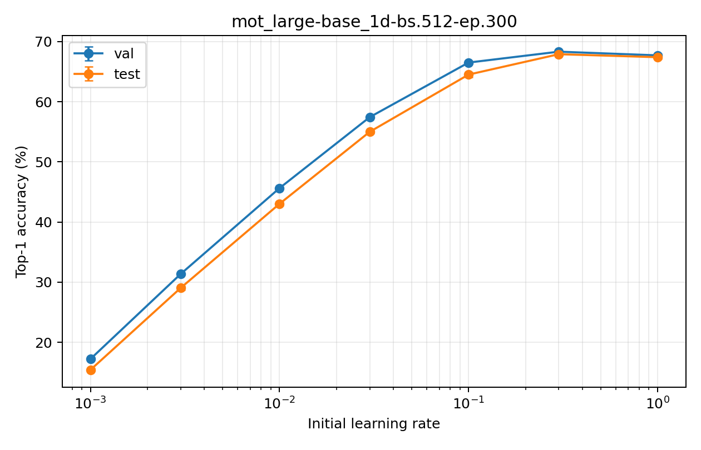

| LR | Val top-1 | Val macro | Val top-5 | Test top-1 | Test macro | Test top-5 |
|---:|---:|---:|---:|---:|---:|---:|
| 0.001 | 17.22 +/- 0.19 | 14.33 +/- 0.25 | 37.85 +/- 0.59 | 15.42 +/- 0.21 | 13.10 +/- 0.14 | 36.29 +/- 0.52 |
| 0.003 | 31.36 +/- 0.14 | 29.17 +/- 0.02 | 57.76 +/- 0.36 | 29.04 +/- 0.35 | 26.52 +/- 0.22 | 55.59 +/- 0.43 |
| 0.01 | 45.63 +/- 0.11 | 44.25 +/- 0.24 | 71.19 +/- 0.20 | 43.02 +/- 0.33 | 40.61 +/- 0.30 | 69.23 +/- 0.29 |
| 0.03 | 57.44 +/- 0.04 | 56.92 +/- 0.05 | 79.49 +/- 0.06 | 55.00 +/- 0.23 | 53.09 +/- 0.28 | 78.23 +/- 0.10 |
| 0.1 | 66.51 +/- 0.19 | 66.16 +/- 0.27 | 84.16 +/- 0.33 | 64.51 +/- 0.42 | 62.84 +/- 0.28 | 83.89 +/- 0.25 |
| 0.3 | 68.32 +/- 0.06 | 68.11 +/- 0.09 | 85.79 +/- 0.02 | 67.90 +/- 0.23 | 66.43 +/- 0.17 | 85.50 +/- 0.15 |
| 1 | 67.71 +/- 0.25 | 67.63 +/- 0.33 | 85.35 +/- 0.07 | 67.41 +/- 0.24 | 66.01 +/- 0.30 | 85.09 +/- 0.19 |

Across the evaluated range, validation top-1 spans 51.10 percentage points and test top-1 spans 52.49 percentage points.

### mot_large-huge_1d-bs.512-ep.300

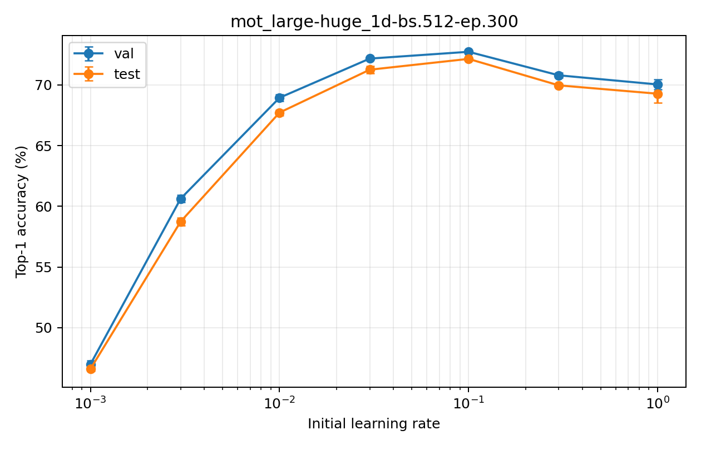

| LR | Val top-1 | Val macro | Val top-5 | Test top-1 | Test macro | Test top-5 |
|---:|---:|---:|---:|---:|---:|---:|
| 0.001 | 47.00 +/- 0.31 | 45.34 +/- 0.18 | 72.03 +/- 0.41 | 46.61 +/- 0.18 | 44.25 +/- 0.29 | 70.56 +/- 0.36 |
| 0.003 | 60.64 +/- 0.29 | 59.51 +/- 0.29 | 80.42 +/- 0.28 | 58.75 +/- 0.33 | 56.92 +/- 0.41 | 79.43 +/- 0.57 |
| 0.01 | 68.95 +/- 0.28 | 68.17 +/- 0.28 | 84.91 +/- 0.22 | 67.73 +/- 0.23 | 65.99 +/- 0.11 | 84.79 +/- 0.16 |
| 0.03 | 72.17 +/- 0.09 | 71.41 +/- 0.05 | 87.30 +/- 0.18 | 71.26 +/- 0.28 | 69.90 +/- 0.30 | 86.52 +/- 0.16 |
| 0.1 | 72.73 +/- 0.04 | 72.35 +/- 0.07 | 87.71 +/- 0.06 | 72.15 +/- 0.04 | 70.80 +/- 0.04 | 87.24 +/- 0.12 |
| 0.3 | 70.80 +/- 0.20 | 70.36 +/- 0.22 | 87.10 +/- 0.15 | 69.97 +/- 0.11 | 68.55 +/- 0.23 | 87.02 +/- 0.18 |
| 1 | 70.04 +/- 0.40 | 69.59 +/- 0.38 | 86.67 +/- 0.27 | 69.28 +/- 0.77 | 67.77 +/- 0.71 | 86.28 +/- 0.08 |

Across the evaluated range, validation top-1 spans 25.74 percentage points and test top-1 spans 25.54 percentage points.

### mot_large_1d-bs.512-ep.300

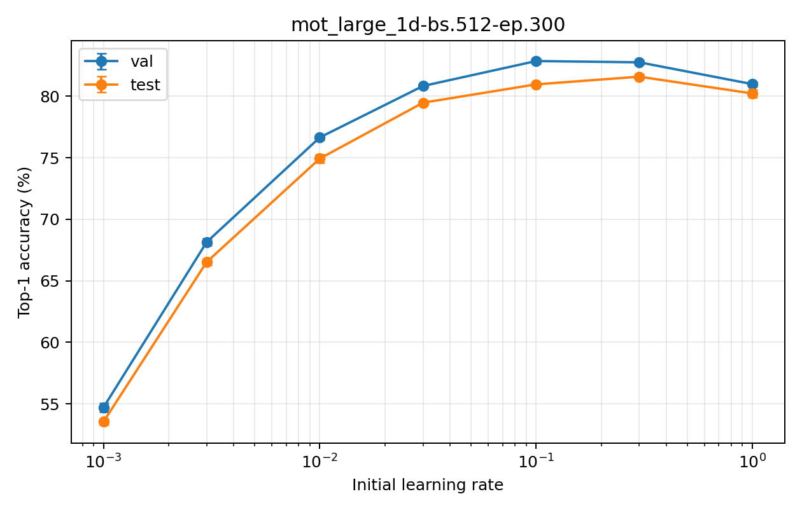

| LR | Val top-1 | Val macro | Val top-5 | Test top-1 | Test macro | Test top-5 |
|---:|---:|---:|---:|---:|---:|---:|
| 0.001 | 54.71 +/- 0.36 | 53.54 +/- 0.51 | 75.97 +/- 0.79 | 53.55 +/- 0.25 | 51.38 +/- 0.24 | 75.71 +/- 0.47 |
| 0.003 | 68.15 +/- 0.28 | 67.38 +/- 0.27 | 85.35 +/- 0.30 | 66.53 +/- 0.27 | 64.73 +/- 0.30 | 84.42 +/- 0.11 |
| 0.01 | 76.65 +/- 0.19 | 76.13 +/- 0.22 | 90.12 +/- 0.12 | 74.93 +/- 0.33 | 73.50 +/- 0.41 | 89.15 +/- 0.04 |
| 0.03 | 80.83 +/- 0.06 | 80.36 +/- 0.02 | 92.24 +/- 0.04 | 79.47 +/- 0.15 | 78.29 +/- 0.22 | 90.93 +/- 0.00 |
| 0.1 | 82.86 +/- 0.19 | 82.42 +/- 0.23 | 92.86 +/- 0.02 | 80.96 +/- 0.06 | 79.94 +/- 0.06 | 92.06 +/- 0.02 |
| 0.3 | 82.75 +/- 0.17 | 82.25 +/- 0.16 | 93.26 +/- 0.15 | 81.59 +/- 0.20 | 80.70 +/- 0.21 | 92.91 +/- 0.11 |
| 1 | 80.98 +/- 0.17 | 80.45 +/- 0.27 | 93.01 +/- 0.10 | 80.22 +/- 0.30 | 79.17 +/- 0.22 | 92.72 +/- 0.11 |

Across the evaluated range, validation top-1 spans 28.15 percentage points and test top-1 spans 28.04 percentage points.

### mot_small-base_1d-bs.512-ep.300

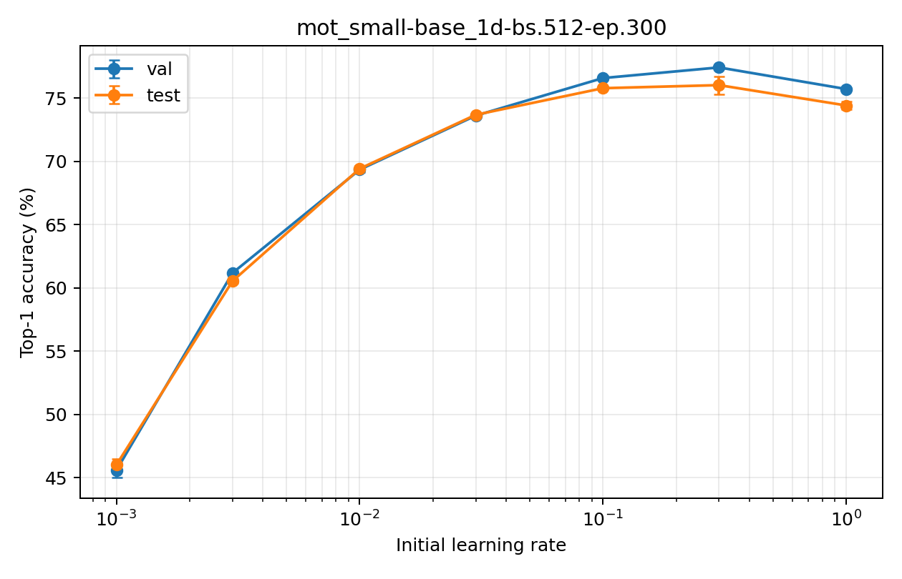

| LR | Val top-1 | Val macro | Val top-5 | Test top-1 | Test macro | Test top-5 |
|---:|---:|---:|---:|---:|---:|---:|
| 0.001 | 45.58 +/- 0.58 | 44.03 +/- 0.44 | 70.53 +/- 0.34 | 46.01 +/- 0.48 | 43.38 +/- 0.53 | 70.96 +/- 0.28 |
| 0.003 | 61.17 +/- 0.15 | 60.38 +/- 0.19 | 80.09 +/- 0.31 | 60.53 +/- 0.16 | 58.72 +/- 0.20 | 80.09 +/- 0.10 |
| 0.01 | 69.34 +/- 0.22 | 68.97 +/- 0.18 | 85.79 +/- 0.22 | 69.42 +/- 0.22 | 67.94 +/- 0.28 | 85.37 +/- 0.16 |
| 0.03 | 73.61 +/- 0.08 | 73.48 +/- 0.15 | 88.35 +/- 0.24 | 73.68 +/- 0.18 | 72.35 +/- 0.18 | 87.83 +/- 0.07 |
| 0.1 | 76.58 +/- 0.16 | 76.59 +/- 0.20 | 89.65 +/- 0.08 | 75.78 +/- 0.11 | 74.44 +/- 0.11 | 89.26 +/- 0.09 |
| 0.3 | 77.43 +/- 0.11 | 77.43 +/- 0.18 | 90.53 +/- 0.28 | 76.03 +/- 0.71 | 74.62 +/- 0.71 | 89.82 +/- 0.07 |
| 1 | 75.72 +/- 0.08 | 75.49 +/- 0.08 | 90.34 +/- 0.13 | 74.42 +/- 0.31 | 73.23 +/- 0.30 | 89.65 +/- 0.11 |

Across the evaluated range, validation top-1 spans 31.84 percentage points and test top-1 spans 30.02 percentage points.

### mot_small-tiny_1d-bs.512-ep.300

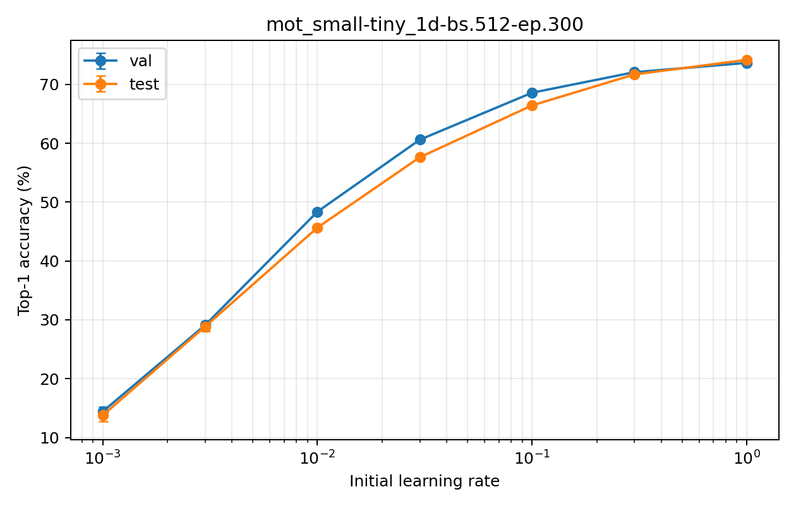

| LR | Val top-1 | Val macro | Val top-5 | Test top-1 | Test macro | Test top-5 |
|---:|---:|---:|---:|---:|---:|---:|
| 0.001 | 14.42 +/- 0.77 | 12.22 +/- 0.92 | 37.87 +/- 1.06 | 13.77 +/- 1.04 | 11.49 +/- 1.01 | 36.37 +/- 0.79 |
| 0.003 | 29.10 +/- 0.57 | 26.87 +/- 0.55 | 57.90 +/- 0.39 | 28.86 +/- 0.77 | 26.01 +/- 0.72 | 55.93 +/- 0.29 |
| 0.01 | 48.37 +/- 0.24 | 46.69 +/- 0.28 | 72.44 +/- 0.04 | 45.66 +/- 0.37 | 43.17 +/- 0.44 | 71.04 +/- 0.43 |
| 0.03 | 60.61 +/- 0.18 | 59.99 +/- 0.24 | 79.54 +/- 0.04 | 57.63 +/- 0.14 | 55.81 +/- 0.16 | 79.07 +/- 0.17 |
| 0.1 | 68.59 +/- 0.13 | 68.24 +/- 0.18 | 84.59 +/- 0.08 | 66.44 +/- 0.14 | 65.03 +/- 0.24 | 84.70 +/- 0.14 |
| 0.3 | 72.08 +/- 0.10 | 71.72 +/- 0.09 | 87.09 +/- 0.22 | 71.70 +/- 0.27 | 70.34 +/- 0.22 | 87.49 +/- 0.13 |
| 1 | 73.66 +/- 0.06 | 73.35 +/- 0.13 | 88.41 +/- 0.33 | 74.18 +/- 0.27 | 72.71 +/- 0.30 | 89.05 +/- 0.02 |

Across the evaluated range, validation top-1 spans 59.25 percentage points and test top-1 spans 60.41 percentage points.

### mot_small_1d-bs.512-ep.300

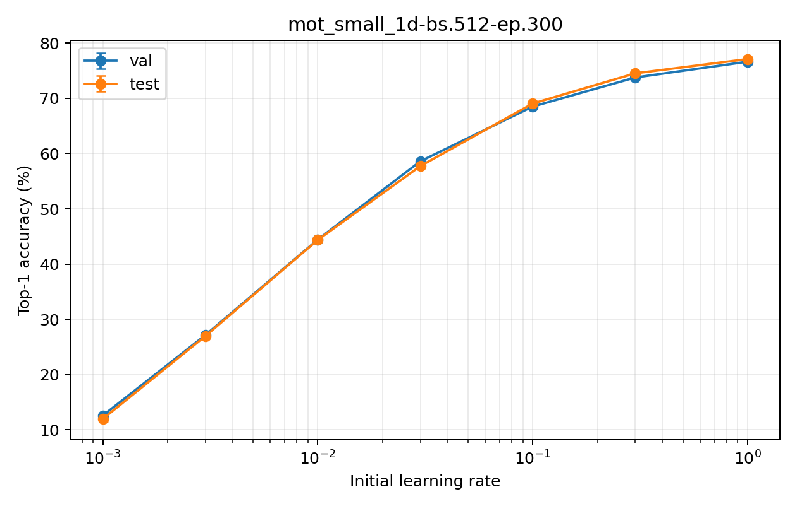

| LR | Val top-1 | Val macro | Val top-5 | Test top-1 | Test macro | Test top-5 |
|---:|---:|---:|---:|---:|---:|---:|
| 0.001 | 12.58 +/- 0.33 | 10.00 +/- 0.26 | 32.52 +/- 0.38 | 11.97 +/- 0.47 | 9.45 +/- 0.42 | 30.91 +/- 0.11 |
| 0.003 | 27.14 +/- 0.26 | 24.56 +/- 0.32 | 55.46 +/- 0.40 | 26.97 +/- 0.11 | 23.98 +/- 0.10 | 54.37 +/- 0.46 |
| 0.01 | 44.44 +/- 0.08 | 42.58 +/- 0.13 | 71.93 +/- 0.21 | 44.38 +/- 0.08 | 41.79 +/- 0.08 | 70.48 +/- 0.35 |
| 0.03 | 58.61 +/- 0.06 | 57.79 +/- 0.08 | 80.09 +/- 0.17 | 57.74 +/- 0.12 | 55.46 +/- 0.14 | 80.64 +/- 0.10 |
| 0.1 | 68.51 +/- 0.18 | 68.13 +/- 0.16 | 85.99 +/- 0.12 | 69.06 +/- 0.10 | 67.22 +/- 0.10 | 85.99 +/- 0.13 |
| 0.3 | 73.78 +/- 0.02 | 73.52 +/- 0.03 | 88.62 +/- 0.02 | 74.53 +/- 0.22 | 72.90 +/- 0.25 | 88.87 +/- 0.11 |
| 1 | 76.65 +/- 0.15 | 76.33 +/- 0.11 | 90.21 +/- 0.08 | 77.12 +/- 0.13 | 75.65 +/- 0.15 | 90.30 +/- 0.04 |

Across the evaluated range, validation top-1 spans 64.07 percentage points and test top-1 spans 65.15 percentage points.

### mot_tiny-small_1d-bs.512-ep.300

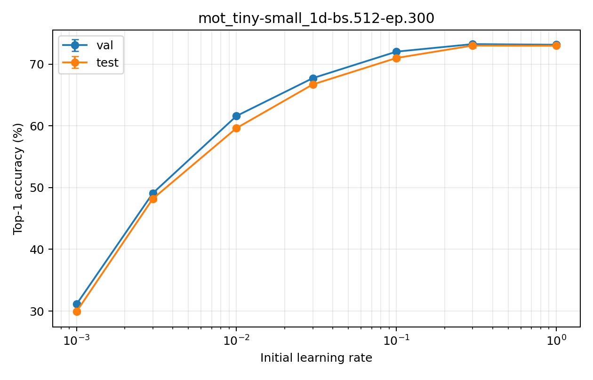

| LR | Val top-1 | Val macro | Val top-5 | Test top-1 | Test macro | Test top-5 |
|---:|---:|---:|---:|---:|---:|---:|
| 0.001 | 31.10 +/- 0.27 | 29.13 +/- 0.43 | 57.16 +/- 0.83 | 29.92 +/- 0.30 | 27.36 +/- 0.19 | 56.43 +/- 0.41 |
| 0.003 | 49.10 +/- 0.40 | 48.03 +/- 0.47 | 71.18 +/- 0.27 | 48.20 +/- 0.31 | 45.78 +/- 0.28 | 71.07 +/- 0.71 |
| 0.01 | 61.61 +/- 0.11 | 60.93 +/- 0.11 | 79.26 +/- 0.16 | 59.64 +/- 0.20 | 57.81 +/- 0.22 | 79.65 +/- 0.24 |
| 0.03 | 67.74 +/- 0.22 | 67.20 +/- 0.13 | 83.79 +/- 0.14 | 66.72 +/- 0.08 | 65.04 +/- 0.07 | 84.00 +/- 0.19 |
| 0.1 | 72.03 +/- 0.06 | 71.72 +/- 0.03 | 86.46 +/- 0.13 | 71.00 +/- 0.34 | 69.45 +/- 0.31 | 86.75 +/- 0.15 |
| 0.3 | 73.26 +/- 0.04 | 72.94 +/- 0.14 | 88.08 +/- 0.08 | 73.03 +/- 0.35 | 71.45 +/- 0.29 | 88.18 +/- 0.37 |
| 1 | 73.15 +/- 0.20 | 72.93 +/- 0.13 | 88.87 +/- 0.08 | 72.99 +/- 0.14 | 71.50 +/- 0.17 | 88.54 +/- 0.08 |

Across the evaluated range, validation top-1 spans 42.15 percentage points and test top-1 spans 43.11 percentage points.

### mot_tiny_1d-bs.512-ep.300

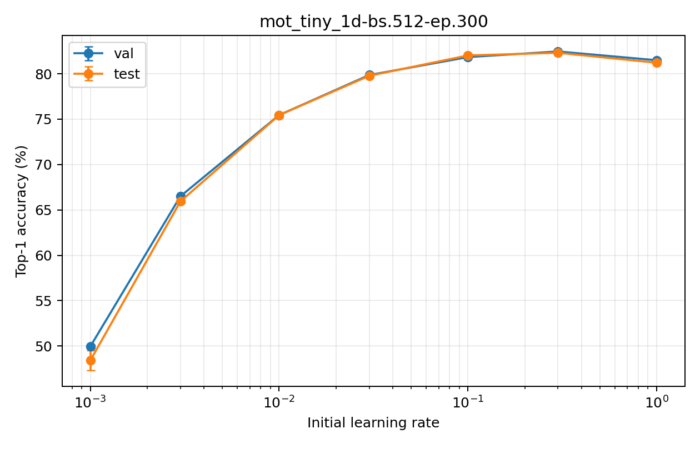

| LR | Val top-1 | Val macro | Val top-5 | Test top-1 | Test macro | Test top-5 |
|---:|---:|---:|---:|---:|---:|---:|
| 0.001 | 49.96 +/- 0.15 | 47.37 +/- 0.30 | 72.90 +/- 0.29 | 48.42 +/- 1.09 | 45.80 +/- 0.91 | 71.74 +/- 0.22 |
| 0.003 | 66.50 +/- 0.15 | 65.52 +/- 0.26 | 83.57 +/- 0.35 | 65.94 +/- 0.16 | 64.01 +/- 0.23 | 82.63 +/- 0.30 |
| 0.01 | 75.45 +/- 0.07 | 74.82 +/- 0.09 | 88.22 +/- 0.07 | 75.44 +/- 0.21 | 74.12 +/- 0.21 | 89.05 +/- 0.02 |
| 0.03 | 79.86 +/- 0.10 | 79.42 +/- 0.10 | 90.16 +/- 0.06 | 79.78 +/- 0.21 | 78.89 +/- 0.20 | 91.55 +/- 0.10 |
| 0.1 | 81.84 +/- 0.07 | 81.47 +/- 0.03 | 91.70 +/- 0.04 | 82.02 +/- 0.20 | 81.06 +/- 0.17 | 92.40 +/- 0.22 |
| 0.3 | 82.46 +/- 0.02 | 82.13 +/- 0.06 | 92.38 +/- 0.06 | 82.31 +/- 0.17 | 81.42 +/- 0.20 | 93.02 +/- 0.06 |
| 1 | 81.49 +/- 0.07 | 81.14 +/- 0.10 | 92.38 +/- 0.06 | 81.22 +/- 0.14 | 80.26 +/- 0.15 | 93.01 +/- 0.06 |

Across the evaluated range, validation top-1 spans 32.50 percentage points and test top-1 spans 33.89 percentage points.

## Raw artifacts

- [Per-seed results](sweep-results.csv)
- [Per-LR aggregates](aggregate-results.csv)
- [Per-epoch metrics](epoch-metrics.csv)
- [Experiment configuration](sweep-config.json)
- Best linear heads and individual metrics are stored under `runs/<run>/lr-*/seed-*`.
