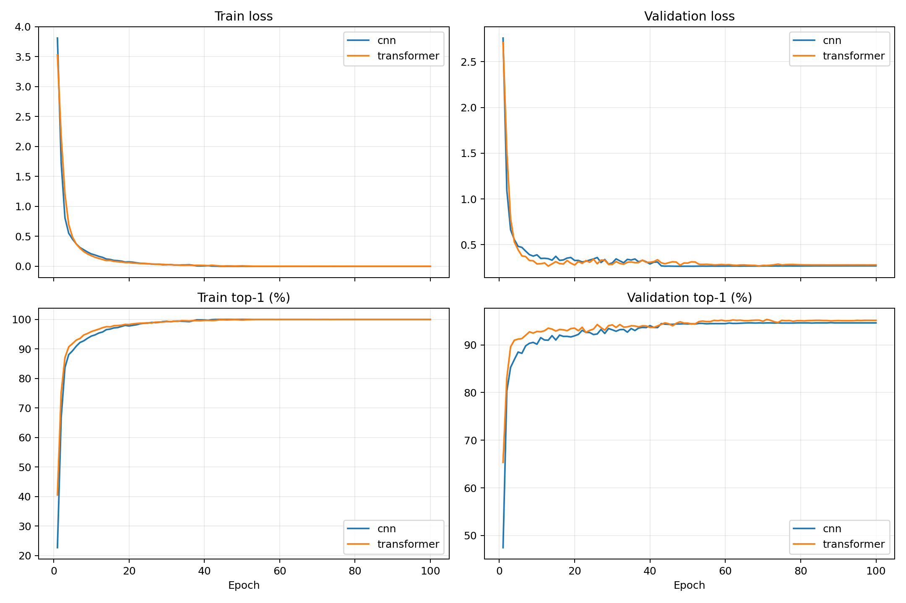

# 100STYLE Supervised CNN and Transformer Classifiers

Both models were trained from raw 100STYLE motion `[90,366]` with seed 42.

## Shared settings

- Dataset train statistics normalization
- CrossEntropyLoss; no class weighting, balanced sampling, or augmentation
- AdamW, LR 3e-4, weight decay 0.05
- 5-epoch warmup followed by cosine decay, 100 epochs
- CUDA BF16 autocast; float32 parameters and optimizer
- Best validation top-1 checkpoint restored before one test evaluation

## Results

| Model | Parameters | Best epoch | Val top-1 | Val macro | Val top-5 | Test top-1 | Test macro | Test top-5 |
|---|---:|---:|---:|---:|---:|---:|---:|---:|
| cnn | 6,371,172 | 88 | 94.65 | 94.46 | 97.71 | 94.30 | 93.71 | 98.01 |
| transformer | 6,461,284 | 71 | 95.33 | 95.25 | 98.13 | 95.14 | 94.65 | 98.13 |

## Model architecture

- CNN: temporal ResNet, widths 256/384/512, two blocks per stage, masked mean pooling.
- Transformer (historical run): dim 256, 8 blocks, 8 heads, MLP ratio 4, masked mean pooling. This result predates the current CLS-token implementation.

## Raw metrics

- [CNN metrics](cnn-metrics.csv)
- [Transformer metrics](transformer-metrics.csv)
