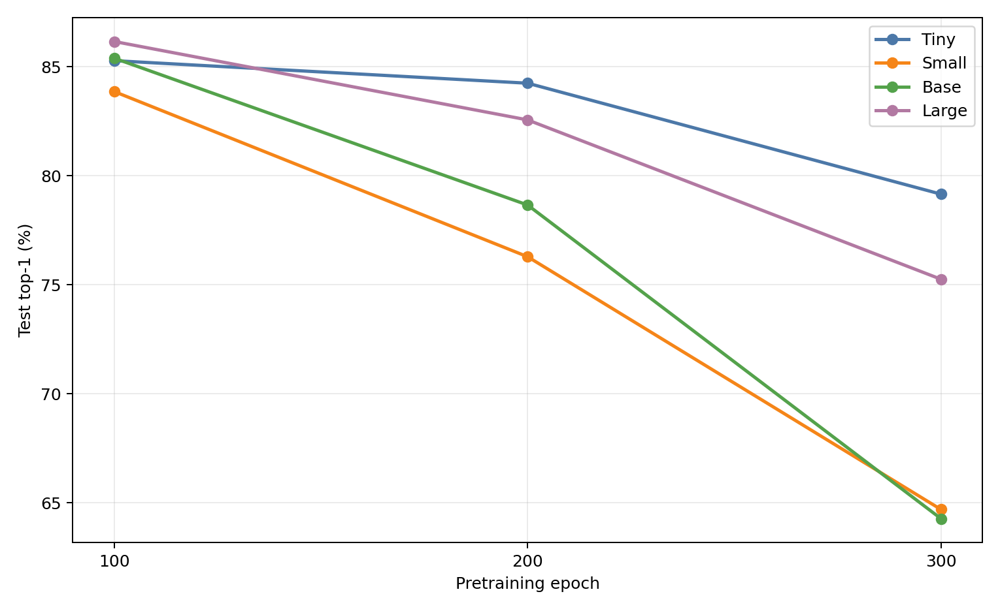
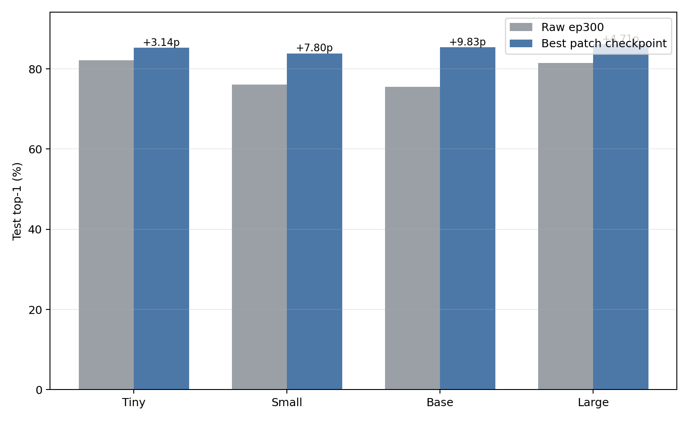

# 002 — Patch 1D Linear-Probe Evaluation

## Summary

Temporal patch size 3으로 학습한 Tiny/Small/Base/Large encoder를 pretraining epoch 100, 200, 300에서 frozen linear probe로 평가했다. 네 모델 모두 **ep100이 가장 좋았고 이후 일관되게 악화됐다.** 따라서 ep300 성능 저하는 학습 부족이 아니며, 현재 objective를 오래 최적화할수록 100STYLE에서 선형 분리 가능한 표현이 퇴화하는 현상으로 해석하는 것이 타당하다.

ep100 test top-1은 Tiny 85.27%, Small 83.86%, Base 85.39%, Large 86.15%다. `findings/000`의 동일 크기 raw ep300 baseline보다 각각 +3.14%p, +7.80%p, +9.83%p, +4.71%p 높다. 즉 **patchification 자체가 나쁜 것은 아니며, 적절한 checkpoint에서는 raw baseline보다 좋다.** 문제는 100 epoch 이후의 representation degradation이다.

## Checkpoint trajectory

각 checkpoint에서 LR `0.1, 0.3, 0.5, 0.7, 1.0`을 모두 다시 sweep했다. LR와 linear-head epoch는 validation top-1만으로 선택했으며 test metric은 선택에 사용하지 않았다.

| Size | Pretrain epoch | Selected LR | Probe epoch | Val top-1 | Test top-1 | Δ from ep100 |
|---|---:|---:|---:|---:|---:|---:|
| Tiny | 100 | 0.3 | 43 | 86.16% | 85.27% | — |
| Tiny | 200 | 0.3 | 46 | 83.86% | 84.24% | -1.03%p |
| Tiny | 300 | 0.3 | 39 | 80.57% | 79.15% | -6.12%p |
| Small | 100 | 0.5 | 47 | 85.16% | 83.86% | — |
| Small | 200 | 0.1 | 35 | 76.60% | 76.28% | -7.57%p |
| Small | 300 | 1.0 | 44 | 66.16% | 64.69% | -19.17%p |
| Base | 100 | 0.1 | 39 | 84.67% | 85.39% | — |
| Base | 200 | 0.1 | 37 | 78.09% | 78.65% | -6.73%p |
| Base | 300 | 0.3 | 40 | 64.86% | 64.27% | -21.12%p |
| Large | 100 | 0.1 | 35 | 86.85% | 86.15% | — |
| Large | 200 | 0.3 | 42 | 83.02% | 82.56% | -3.60%p |
| Large | 300 | 0.1 | 41 | 75.45% | 75.25% | -10.90%p |

Pretraining loss는 반대로 대체로 감소했다. 각 checkpoint epoch에서 minibatch loss의 평균은 다음과 같다.

| Size | ep100 loss | ep200 loss | ep300 loss |
|---|---:|---:|---:|
| Tiny | 0.0668 | 0.0677 | 0.0375 |
| Small | 0.0658 | 0.0537 | 0.0390 |
| Base | 0.0646 | 0.0433 | 0.0261 |
| Large | 0.0587 | 0.0421 | 0.0202 |

특히 Base는 JEPA loss가 가장 낮아지는 동안 test top-1이 85.39%에서 64.27%로 떨어졌다. 이는 단순 undertraining 설명과 맞지 않는다. 더 오래 학습하기 전에 early stopping 기준, mask 난이도와 predictor/target dynamics를 점검해야 한다.

## Raw comparison

Raw 값은 이번 실험에서 재실행하지 않고 [`findings/000-100style-classification`](../000-100style-classification/README.md)의 고정 ep300 결과를 사용했다.

| Size | Raw ep300 test | Best patch epoch | Best patch test | Patch - Raw |
|---|---:|---:|---:|---:|
| Tiny | 82.13% | 100 | 85.27% | +3.14%p |
| Small | 76.05% | 100 | 83.86% | +7.80%p |
| Base | 75.55% | 100 | 85.39% | +9.83%p |
| Large | 81.45% | 100 | 86.15% | +4.71%p |

기존 ep300끼리만 비교한 그림과 데이터도 보존했다.

- [`patch-vs-raw-test-top1.png`](patch-vs-raw-test-top1.png)
- [`patch-vs-raw-selected-results.csv`](patch-vs-raw-selected-results.csv)
- [`ep300-selected-results.csv`](ep300-selected-results.csv)

## Protocol

- Dataset: `dataset/100style-soma77-processed` (train 20,916 / validation 2,615 / test 2,614)
- Encoder: immutable checkpoint의 frozen EMA target encoder
- Pooling: sample별 valid-token global mean
- Geometry: 90 raw frames, temporal patch size 3, 30 tokens
- LR sweep: 0.1, 0.3, 0.5, 0.7, 1.0
- Seed: 42
- Probe: 50 epochs, SGD, momentum 0.9, weight decay 0, cosine LR decay
- Batch: probe 256, feature extraction 128, workers 4
- Selection: validation top-1 only; 동률이면 낮은 LR
- Device: `cuda:0`, `/opt/conda/envs/kimodo/bin/python`

총 60개 probe run(4 sizes × 3 checkpoints × 5 LRs)이 모두 완료됐고 failure는 0건이다. Feature extraction은 batch 128에서 OOM 없이 끝났다. Cache를 사용할 때마다 checkpoint SHA, dataset index SHA, normalization SHA, patch size 3, token length 30이 signature로 검증됐다.

## Checkpoints

변경될 수 있는 `latest` 대신 immutable checkpoint를 사용했다.

| Size | Epoch | SHA256 |
|---|---:|---|
| Tiny | 100 | `eb7cf4325610acd7ba02e811ad6777037d14ffaf582beea7463c0cfe71066149` |
| Tiny | 200 | `d586e32397783edb375b6cc0a43c1ebd8871ded3e9dd947d389b80b62f58bda1` |
| Tiny | 300 | `d5789229811c72842e87e924041202b867c150e1ac6ac4090eef80a11fdb3821` |
| Small | 100 | `1d70941e374e414068c573efd5109e9ac66e75aba001dacf83dfa1a973134f9e` |
| Small | 200 | `947e21476fc239bc5681e001c9190da6c5faadb4ed0d3ad68a5b2bdf5d403dd1` |
| Small | 300 | `b9ba81dc5c18c57550e1294c3af4a462a03b0122e02d35f659796ff21d908f3f` |
| Base | 100 | `331723e348bd953f3cfd9d5e47d7267a69c322ad3894c1db697a5716ab524616` |
| Base | 200 | `9b8c00e723401a2a9e6f1867a8d0073bb7b2916ac835e507cdc9fc4b15da2277` |
| Base | 300 | `69a55436007c0a3297d895e520e0cec0685ebeb2e2f33af2c4a235688e9d2051` |
| Large | 100 | `bd50943fcaebafe5a2fdd1cf763254b80ab7cba8f8f48dda202a105ce8e44a5c` |
| Large | 200 | `78ee52a67dccbfbe22e3cc7a3e91f5efd09699c0d9061626de6b08df87557dcc` |
| Large | 300 | `1d071501ba099a10312d5933d2d92108825b201f5bacbbddfab797900512e877` |

## Large completion

Large patch 학습이 epoch 300 / global step 255,000으로 완료된 뒤 immutable ep100/200/300 checkpoint를 추가 평가했다. ep300과 `latest`는 동일한 SHA256을 가졌으며 probe 실행 시 다른 학습 프로세스는 없었다. Large에서도 ep100 이후 하락이 재현돼 기존 Tiny/Small/Base 결론이 규모 512 encoder까지 확장된다.

## Artifacts

- [`selected-results.csv`](selected-results.csv): checkpoint별 validation-selected 결과 12개
- [`best-checkpoint-vs-raw-selected-results.csv`](best-checkpoint-vs-raw-selected-results.csv): 모델별 best patch와 raw 비교
- [`sweep-results.csv`](sweep-results.csv): 60개 최종 결과
- [`aggregate-results.csv`](aggregate-results.csv): checkpoint/LR aggregate
- [`epoch-metrics.csv`](epoch-metrics.csv): 3,000개 probe epoch metric
- [`sweep-config.json`](sweep-config.json): checkpoint hashes와 실행 설정
- `plots/`: 12개 checkpoint별 LR curve
- `runs/<model-epoch>/lr-*/seed-42/`: best linear head, metrics, summary

## Interpretation and next step

현재 결과는 500~600 epoch 연장보다 **100 epoch 부근 early stopping과 degradation 원인 분석**을 우선해야 함을 보여준다. 다음 실험은 100 epoch 전후를 더 촘촘히 저장한 checkpoint로 peak 위치를 찾거나, 기존 학습에서 checkpoint가 없다면 새 run에 25~50 epoch 간격 저장을 적용하는 것이 적절하다. 동시에 target feature variance/covariance, token variance, predictor loss와 downstream probe의 상관을 추적하면 collapse 또는 objective overfitting 여부를 구분할 수 있다.

## Limitations

- 모델과 checkpoint별 seed가 42 하나뿐이어서 분산을 추정하지 못했다.
- Raw baseline은 ep300만 사용했으므로 raw 모델의 epoch trajectory와 직접 비교하지 않았다.
- 100 epoch 이전 checkpoint가 없어 실제 peak가 100보다 앞인지 뒤인지 알 수 없다.
- Linear probing은 표현의 선형 분리 가능성을 측정하며 fine-tuning 성능을 직접 대변하지 않는다.
